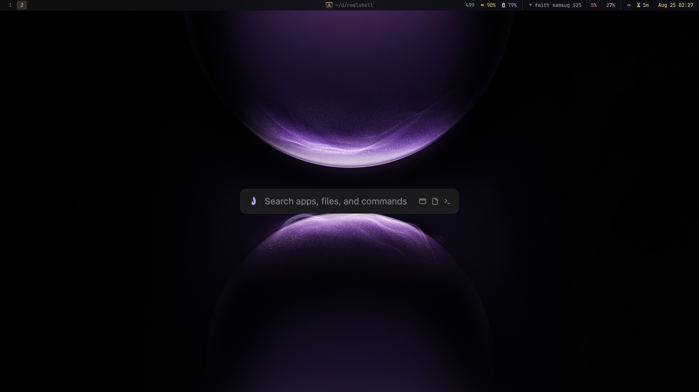
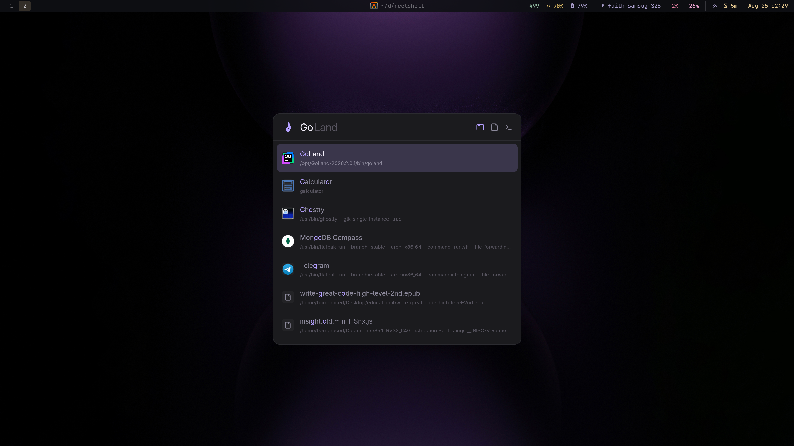
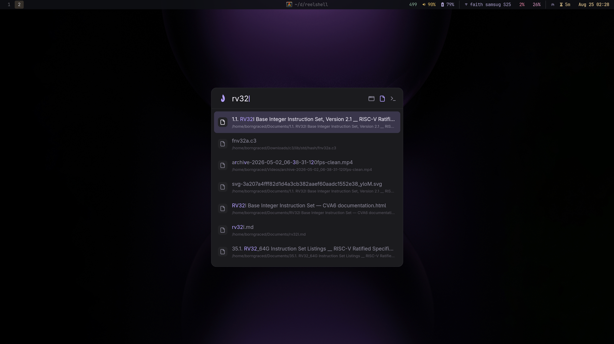
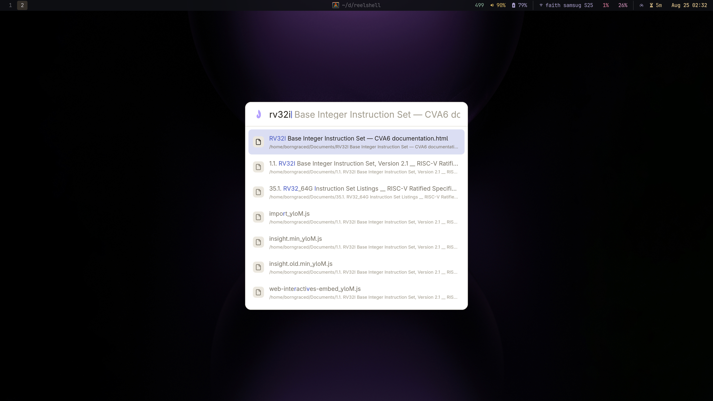
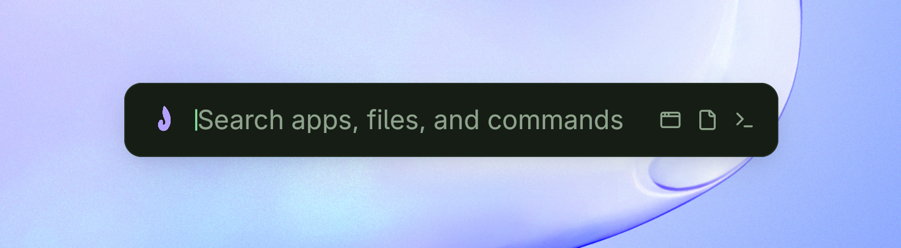
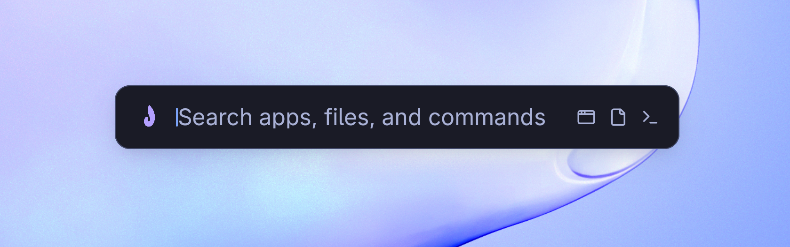
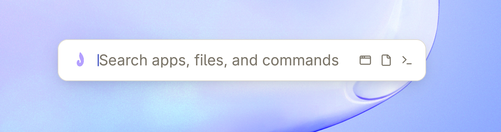
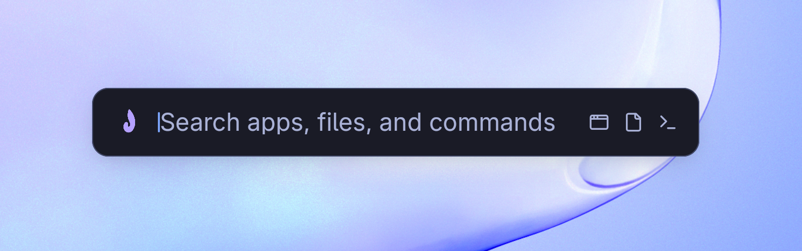
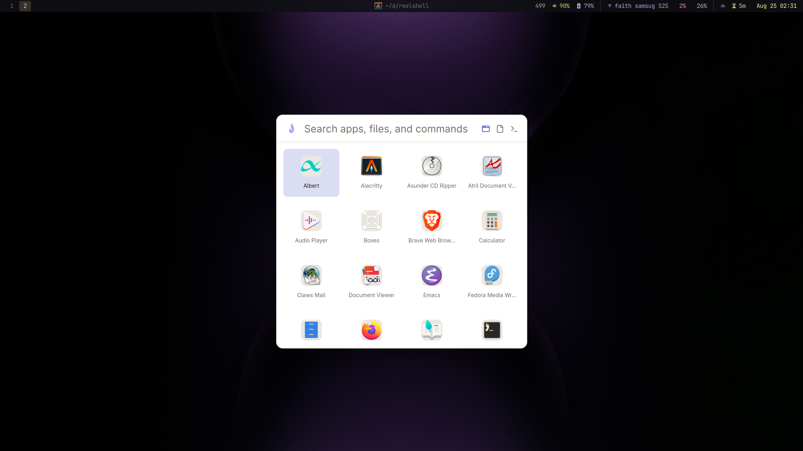
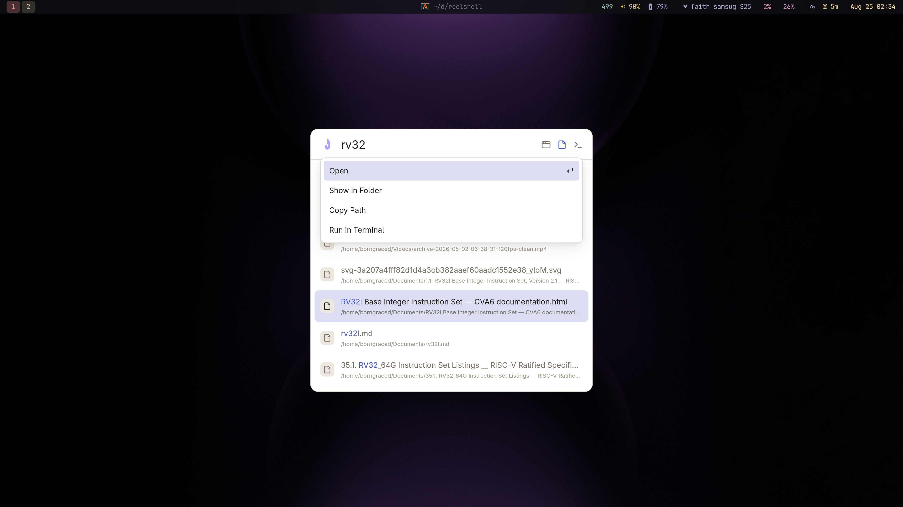

<p align="center">
  
</p>

# Àwárí

A blazingly fast launcher for Wayland compositors like niri and Hyprland, triggered in just 2.78 ms. Hit Super,
type, and instantly get a ranked list of windows, apps, and files. Awari is
powered by [fff-search](https://github.com/dmtrKovalenko/fff): an in-process,
frecency-ranked index that doesn't waste CPU cycles spawning subprocesses on
every keystroke.

By separating a tiny, GPU-free background daemon from a warm GPU overlay, Awari
pops onto your screen in an unnoticeable ~19 ms while maintaining a lean idle
footprint. For ultra-low-spec hardware, it can easily drop down to a pure
on-demand mode to free up every megabyte of RAM.

The name Awari is Yoruba for "a discovery."


## Screenshots

<table>
  <tr>
    <td></td>
    <td></td>
  </tr>
  <tr>
    <td></td>
    <td></td>
  </tr>
</table>

## More demos

### Themes

<table>
  <tr>
    <td align="center"><br><sub>Verdant</sub></td>
    <td align="center"><br><sub>Ember</sub></td>
  </tr>
  <tr>
    <td align="center"><br><sub>Paper</sub></td>
    <td align="center"><br><sub>Tokyo Night</sub></td>
  </tr>
</table>

### Views

<table>
  <tr>
    <td align="center"><br><sub>Apps category</sub></td>
    <td align="center"><br><sub>Alt+Enter action menu</sub></td>
  </tr>
</table>

## Motivation

Most launchers fork a search tool every keystroke (fd, fzf, rg) or spin up a web
runtime just to draw a box, with files as an afterthought. Àwárí runs file search
in-process via fff-search and ranks windows, apps, and files together, so there's
no subprocess per character and you get whichever you meant. A resident, GPU-free
shell opens the overlay with a socket message; by default it's kept alive (hidden)
for instant re-opens (~19 ms, ~77 MB idle), or torn down with `keep-alive = false`
/ `--no-keep-alive` (~100 ms rebuild, 8.5 MB idle).

## Usage

Bind a key to `awari toggle-launcher` and press it to open. Type to filter; the
top match stays selected. `Enter` activates and closes; `Escape` or a background
click dismisses; `Up`/`Down` move the selection. `Tab` ghost-completes the
selected match (or fills the box); `Shift`+`Up`/`Down` recall past queries.
`Alt`+`Enter` opens a per-row menu (Open, Show in Folder, Copy Path, Run in
Terminal, Run).

Query modes:
- Path-shaped (`~`, `/`, `.`, or contains `/`) browses the filesystem; `*.pdf`,
  `!node_modules/` constrain, `../` goes up.
- `o:<path>` lists a path's entries as you type.
- `r:<regex>` filters files by regex.
- `> <command>` runs a shell command in a terminal.
- An arithmetic query shows its result; `Enter` copies it.

Category chips (All, Apps, Files, Commands, Windows) narrow the source.

## Features

- **Lightweight**: GPU-free resident daemon; overlay kept alive hidden (~19 ms
  re-open, ~77 MB idle) or dropped entirely (8.5 MB idle, ~100 ms rebuild).
- **In-process search**: fff-search ranks by frecency with no per-keystroke
  subprocess; `matchq` scores windows/apps without per-keystroke allocation.
  IPC read-to-damage is under 2 ms p99.
- **Bounded**: LRU-capped per-directory indexes; idle CPU ~0 (sustained >1% is a bug).
- **One suggestion**: inline ghost-text completion; full alternates only on ↓.
- **Wayland-native**: one binary for any Wayland compositor. Overlay uses
  `wlr-layer-shell` (niri, Hyprland, sway, river, labwc); on GNOME/Mutter it
  falls back to a normal window for apps/files/commands.
- **Unified results**: windows (focus), apps (`.desktop`), and files in one
  fuzzy/frecency list. Apps always indexed; files and windows toggleable.
- **Query power**: `>` commands, `o:<path>` browse, `r:<regex>`, arithmetic,
  path navigation with constraints.
- **Theming**: KDL hex tokens (no CSS/fetch); nine presets, per-token overrides,
  aliases (`select`, `hover`/`surface`, `fg`, `muted`, `faint`); font/size.
- **Action menu, category chips, calculator, monitor-aware**, lockfiles hidden.

## Build

Linux + Wayland compositor (best on niri, Hyprland, sway, river, labwc via
`wlr-layer-shell`; GNOME/Mutter falls back to a window).

```sh
# Debian/Ubuntu
sudo apt install libwayland-dev libxkbcommon-dev libegl-dev pkg-config
# Fedora
sudo dnf install wayland-devel libxkbcommon-devel mesa-libEGL-devel

cargo test
cargo run -p awari
awari ping
```

## Install

`awari` isn't on crates.io — it depends on a vendored, patched GPUI under
`.third_party/zed` (a local `[patch]` can't be published). Install from git:

```sh
cargo install --git https://github.com/borngraced/awari awari
```

This builds GPUI from source, so the [Build](#build) dev libraries are required.
Then run it as a resident service and bind a key.

```sh
systemctl --user enable --now ~/.config/systemd/user/awari.service
```

**niri** (`~/.config/niri/config.kdl`):

```kdl
spawn-at-startup "awari"
binds {
    Mod+D { spawn "awari" "toggle-launcher"; }
}
```

**Hyprland** (`~/.config/hypr/hyprland.conf`):

```ini
exec-once = awari
bind = SUPER, D, exec, awari toggle-launcher
```

## Configuration

KDL at [`~/.config/awari/config.kdl`](docs/config.md). Unknown keys ignored; no
exec/scripts/shell interpolation; every block/token optional. Copy-pasteable
full file: `contrib/config.kdl`.

```kdl
theme {
  name "catppuccin"            // presets: awari (default) · ash · ember · verdant
                               //          paper · mono · tokyonight · catppuccin · gruvbox
  // font "Inter"             // system family; "default"/"" = GPUI system UI font
  // font-size 14             // px, clamped to 8..=64
  accent      "#cba6f7"       // = select
  accent-dim  "#cba6f733"
  bg          "#11111b"
  panel       "#1e1e2e"
  raise       "#313244"       // = hover = surface
  border      "#45475a"
  text        "#cdd6f4"       // = fg
  text-dim    "#a6adc8"       // = muted
  text-faint  "#9399b2"       // = faint
  scrim       "#08080ce6"
}

files {
  roots "~/Documents" "~/Downloads" "~/code"   // omit/empty = XDG user dirs
  index_lockfiles false                        // show Cargo.lock, *.lock, …
  regex           false                        // file queries as regex (r: prefix forces it)
}

sources {
  windows true
  files   true
}
// apps is always indexed and cannot be disabled

motion {
  reduced     false            // disable animations
  duration-ms 140              // open/close length, clamped to 0..=1000
}
```

Colors are hex: `#RGB`, `#RRGGBB`, or `#RRGGBBAA`. In place of the canonical
token names you can also use these aliases:

| Alias | Sets |
| --- | --- |
| `select` | `accent-dim` |
| `hover`, `surface` | `raise` |
| `fg` | `text` |
| `muted` | `text-dim` |
| `faint` | `text-faint` |
