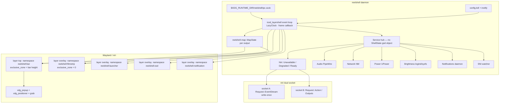
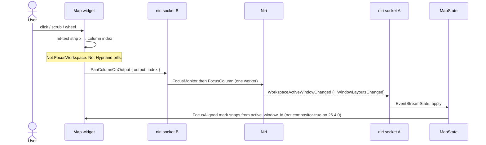

# Reelshell Architecture (historical)

> **Superseded 2026-08-23.** The product is **Àwárí**, an overlay launcher, not a niri map shell. Canonical spec: [`docs/launcher.md`](launcher.md). This file is the old Reelshell map-shell record.

| Field | Value |
|---|---|
| **Title** | Reelshell — niri canvas-map desktop shell |
| **Author** | Reelshell authors |
| **Date** | 2026-08-21 |
| **Status** | Historical (superseded by `docs/launcher.md`) |
| **Version** | 0.2 |
| **Canonical path** | ~~`docs/architecture.md`~~ → `docs/launcher.md` |
| **niri-ipc pin** | `=26.4.0` (crate is **not** Rust-semver stable) |
| **iced_layershell pin** | `=0.19.1` (copy struct fields from that crate at PR2 time) |
| **License** | **GPL-3.0-or-later for the entire workspace** (all crates). `niri-ipc` is GPL-3.0-or-later; iced/wgpu/zbus are MIT/Apache and may only be distributed **as part of a GPL binary**, not dual-licensed MIT. Plugins / proprietary modules are legally incompatible — another reason they are a non-goal. |

---

## Overview

Niri is a scrollable-tiling compositor: each output is an infinite horizontal strip of columns, with dynamic workspaces stacked vertically per output. Users get lost. The built-in Overview is a modal zoom-out. Popular shells (DankMaterialShell, iNiR, Noctalia, Ironbar, Waybar) still ship Hyprland-shaped workspace pills. `niri-ribbon` proved the viewport gadget on Noctalia — it is a module, not a product.

**Reelshell is a niri shell whose identity is the map.** The map is the workspace: columns in order with real relative widths, a **view** mark, and off-screen columns always visible. Interacting with the map pans niri horizontally. Status widgets are a **thin HUD**, not the identity. If the 3-second demo is not “interact with this strip, the real desktop slides,” the product is wrong.

**Name.** **Reelshell** — one word, available as `borngraced/reelshell`. Keeps the strip/scrub metaphor without Instagram “Reels” or a generic `reel` binary. Complements *niri* without prefixing it. Pronounce **REEL-shell**. UI words stay **map / view / HUD** — the product name is not a widget name. Unrelated GitHub hits (`tadigotla/Reelshell`, `Sayandeep1013/ReelShell`) are terminals, not desktop shells.

On **niri-ipc 26.4.0** the view mark is **focus-aligned and approximate** (see [Map geometry](#map-geometry-the-bet)). It becomes compositor-accurate only when niri exposes `Workspace::scrolling_view_pos` ([#4147](https://github.com/niri-wm/niri/pull/4147), not merged). Phase 1 must not claim otherwise.

Default placement: the map **replaces workspace pills inside the existing panel** (~28–32px exclusive zone — not a second bar). Expansion is **hover** onto an overlay filmstrip with `exclusive_zone = 0`, so windows never move.

v1 is niri-only, Rust + iced + iced_layershell, evented services, compositor-side blur, damage-driven frames. Idle fail: `pidstat` >1% for 10s with a static bar.

---

## Background & Motivation

### Current state

- **niri** (`niri-wm/niri`, IPC crate `niri-ipc` 26.4.0): columns never squeeze to fit; new windows append. Workspaces are dynamic and **per output**. `Workspace.is_active` (visible on that output) ≠ `Workspace.is_focused` (the single focused workspace globally). Layout geometry is on `Window.layout` (`WindowLayout`) and streams via `Event::WindowLayoutsChanged`. **`tile_pos_in_workspace_view` is `null` for tiled windows** ([#2381](https://github.com/niri-wm/niri/issues/2381), still open / needs design; [#4166](https://github.com/niri-wm/niri/issues/4166) duplicate). YaLTeR: filling it per tiled tile is not happening, because a resize would update every tile to the right. PR [#4147](https://github.com/niri-wm/niri/pull/4147) proposes `Workspace::scrolling_view_pos` + `Event::WorkspaceViewPosChanged`; **not in 26.4.0, not merged**.
- **Overview** is modal. Layer-shell: `background`/`bottom` zoom with workspaces; `top`/`overlay` stay on the Overview. Fullscreen windows cover `top`; only `overlay` is visible above them.
- **DankMaterialShell / iNiR**: complete QML/Quickshell desktops. iNiR is commonly 200–400MB RSS. They feel like Hyprland bars that happen to run on niri.
- **Noctalia v5**: left Quickshell for memory/idle. Same weight class as Reelshell. Ships `niri-ribbon` as a plugin (`ews/noctalia-niri-ribbon`) — counts of off-screen windows, not a map you steer.
- **Ironbar / Waybar / ashell**: honest bars. Lighter if Reelshell bloats. No map identity.
- **gpui-shell / niri-ipc users**: compositor glue exists; nobody made the map the shell.

### Pain points

1. No always-on sense of **workspace width** or **where the viewport sits**.
2. Clicking workspace `2` is a Hyprland gesture. On niri it is the wrong primitive: you need **horizontal view movement** on the current output’s active workspace.
3. A permanent bottom exclusive-zone filmstrip is a second bar: it steals canvas height and trains users that Reelshell is “another dock.”
4. `qs ipc` / CLI spawn on Super is a frame late. The launcher must already be a live process.

---

## Goals & Non-Goals

### Goals (v1 must exist or the bet is fake)

- **View mark** on the strip (not a “playhead” in the UI). On 26.4.0 this is the **focus-aligned heuristic**; compositor-true origin is a cap, not a lie.
- **Map** = columns in order with real relative widths from niri layout (`WindowLayout.tile_size`, `pos_in_scrolling_layout`).
- **Scrub / click / scroll the map → niri pans** (horizontal view movement). Never `focus_workspace(2)`-shaped jumps.
- **Off-screen columns visible** on the map. **Urgency badges are v1, not Phase 1** (PR9).
- **Idle CPU fail predicate** in the budget table; icons at idle, not live video.
- **Placement**: map in the panel by default; overlay filmstrip with `exclusive_zone = 0` **on hover** (optional IPC toggle). Super-held and two-finger are **out of v1**.
- **HUD**: focused window, clock (minute ticks until hover), SNI tray, network/audio/battery hover menus, niri keyboard layout, OSD (volume + brightness via a dedicated Brightness service).
- **Launcher**: prewarmed overlay; apps + windows on **this output**. Super **spawns a tiny unix-socket client** (`reelshell toggle-launcher`); the overlay is already in the daemon. Never spawn `qs ipc`.
- **Notifications**: Reelshell **is** the daemon. Do not also run mako.
- **Budgets** in [Fast and smooth budgets](#fast-and-smooth-budgets) are constraints with fail predicates.

### Non-goals (explicitly out of v1)

Lock, idle inhibitor UI, polkit agent, wallpaper / matugen, settings GUI, **plugins** (GPL workspace cannot host proprietary plugin ABIs), a second UI family, AI, Hyprland parity, always-on Cava / GPU rings, in-process Gaussian blur, file indexer, hairline ruler / corner chip (optional later), top HUD **plus** reserved bottom dock, Super-held / two-finger filmstrip, compositor-accurate view mark **until** `#4147` (or equivalent) ships in a pinned niri-ipc, `xdg-desktop-portal` RemoteDesktop.

---

## Fast and smooth budgets

These are **release gates**. A feature that blows a budget does not ship. **CI has no GPU test in v1**; Phase 1 (PR6) records the measurements below. Commands: `pidstat -u -p $pid 1 10`, `ps -o rss= -p $pid`, `REELSHELL_TRACE_FRAMES=1` / `REELSHELL_LOG=reelshell::frame=debug`.

| Metric | Target | Fail if |
|---|---|---|
| Idle CPU, bar only, no visualizer | damage-driven sleep, no GPU wake | `pidstat -u -p $pid 1 10` shows reelshell **>1%** for 10s on a static desktop |
| RSS, one output | well under 100MB | Steady `ps -o rss=` **≥ 100000** (KB) after icon warm |
| Launcher (a) IPC → damage | p99 **< 2ms** process-local | Tracing span `ipc_read → request_redraw` p99 ≥ 2ms (warm daemon) |
| Launcher (b) first presented pixel | **≤ next vsync** after (a) | Overlay not committed on the frame callback following damage. A 60Hz period is ~16.7ms; **do not** budget spawn+IPC+present inside 16ms. niri `spawn "reelshell" "toggle-launcher"` is extra and unmetered. |
| Menu hover | every vblank while open; no leave/enter flicker | Popup unmaps when the pointer crosses the 1px gap bar→popup |
| Boot to visible bar | first layer commit; rest deferred | Blank output until niri / NM / desktop files |
| GameMode / reduced-motion | duration 0, effects out of tree | Tweens still scheduled (`Motion::Snap` not taken) |

**Animation:** HUD chrome 120–180ms ease-out (`LazyClock`, one timestamp per event-loop tick). **Map view mark snaps to `MapState.view`** (no second physics). Actions apply immediately. Pace commits with `wl_surface.frame`. No client Gaussian — niri `ext-background-effect` / `layer-rule { background-effect { xray true; blur true } }`.

**Iced idle is a Phase 1 kill:** PR2 must prove no 60/120Hz subscription. If iced’s wgpu presenter cannot sleep, **switch the bar (not only menus) to GTK4 + gtk4-layer-shell** before PR5. Do not start HUD on a spinning bar.

---

## Proposed Design

### Product language

| Term | Meaning | UI copy |
|---|---|---|
| **Map** | Scaled strip of columns for the active workspace on this output | “map” |
| **View** | Highlighted range = current niri viewport | “view” |
| **HUD** | Thin status strip; not the identity | module names only |
| playhead | Internal/docs only | **never in UI** |
| Ribbon | Filmstrip strip that always fits every column | **never in UI** |
| Detail row | Filmstrip row of fixed-size tiles, a scrollable slice | **never in UI** |
| Browse position | Local filmstrip scroll offset; not niri’s view | **never in UI** |

### Process and crate layout (target)

```
reelshell/
  README.md
  docs/
    architecture.md    # this document (canonical)
    map.md
    surfaces.md
    compositor.md
    performance.md
  crates/
    reelshell/              # binary: daemon + `reelshell <cmd>` client
    reelshell-map/          # MapState reconstruction + hit testing
    reelshell-compositor/   # Compositor trait, niri adapter, caps
    reelshell-ipc/          # daemon unix protocol (not niri-ipc)
    reelshell-config/       # KDL load + watch, no exec
    reelshell-services/     # Audio, Network, Power, Brightness, Notifications, Tray
  contrib/
    reelshell.service       # systemd --user
    niri-layer-rules.kdl.example
```

Single process, single instance. `reelshell` with no args (or `reelshell daemon`) is the shell. The **only** client argv is `reelshell toggle-launcher` | `reelshell open-launcher` | `reelshell close-launcher` | `reelshell ping` | `reelshell toggle-filmstrip`: connect to `$XDG_RUNTIME_DIR/reelshell/ipc.sock`, write one JSON line, exit. niri binds spawn that client — never a second GUI. Super is a **unix-socket client**, not in-process key handling.

### Runtime architecture



### Compositor integration (niri-only v1)

Use the official `niri-ipc` crate. **Two sockets** — after `Request::EventStream`, niri stops reading requests on that socket.

Pin exact version:

```toml
niri-ipc = "=26.4.0"
iced_layershell = "=0.19.1"
```

Capability enum exists for a future Hyprland adapter; the adapter is **not implemented** in v1.

```rust
/// What this compositor actually supports. v1 only fills `Niri`.
#[derive(Clone, Debug)]
pub enum CompositorCaps {
    Niri(NiriCaps),
}

#[derive(Clone, Debug)]
pub struct NiriCaps {
    /// `Event::WindowLayoutsChanged` + `Window.layout` — required for the map.
    pub window_layouts: bool,
    /// `Workspace::scrolling_view_pos` + `Event::WorkspaceViewPosChanged` ([#4147](https://github.com/niri-wm/niri/pull/4147)).
    /// **False on 26.4.0.**
    pub scrolling_view_pos: bool,
    pub overview: bool,
    pub casts: bool,
    pub keyboard_layouts: bool,
    /// Output-wide wlr-screencopy (crop client-side). Per-window copy is not assumed.
    pub output_screencopy: bool,
}

/// Commands Reelshell is allowed to issue. Deliberately not Hyprland-shaped.
#[derive(Clone, Debug)]
pub enum CompositorCommand {
    /// Pan by focusing a column (1-based, niri `Action::FocusColumn`) on the **focused** workspace.
    FocusColumn { index: usize },
    FocusWindow { id: u64 },
    FocusColumnLeft,
    FocusColumnRight,
    CenterColumn,
    FocusMonitor { output: String },
    /// Default map click: `FocusMonitor` then `FocusColumn` on the command worker (may steal focus).
    PanColumnOnOutput { output: String, index: usize },
    /// Wheel: `FocusMonitor` then `FocusColumnLeft`/`Right` (`delta` is ±1 or a step count).
    PanColumnDeltaOnOutput { output: String, delta: i8 },
    /// Reserved: true view-offset *write*. Not in niri-ipc 26.4.0.
    #[allow(dead_code)]
    SetViewOrigin { workspace_id: u64, x: f64 },
}

pub trait Compositor: Send + Sync {
    fn caps(&self) -> CompositorCaps;
    fn apply(&self, cmd: CompositorCommand) -> Result<(), CompositorError>;
}
```

Socket B is **serialized on one worker**. Never pipeline two `Action`s that assume no intervening user input (niri processes requests separately; time passes between them). `PanColumnOnOutput` is one Reelshell command that sends two Actions in order on that worker.

**Active ≠ focused.** Each output’s map reads the workspace with `is_active && output == this_output`, not `is_focused`. **v1 default (Q2 closed):** map pointer always sends `PanColumnOnOutput` (focus-steal is acceptable).

Events consumed (see `docs/compositor.md` for apply order):

| Event | Map / HUD use |
|---|---|
| `WorkspacesChanged` | Rebuild per-output active workspace |
| `WorkspaceActivated { id, focused }` | Switch which strip the map shows |
| `WorkspaceUrgencyChanged` | Badge on map if workspace urgent |
| `WorkspaceActiveWindowChanged` | **FocusAligned `F`** via this workspace’s `active_window_id` (not global `Window.is_focused`); HUD |
| `WindowsChanged` / `WindowOpenedOrChanged` / `WindowClosed` | Column membership |
| `WindowFocusChanged` | HUD title on the **focused** output only; do not drive FocusAligned |
| `WindowUrgencyChanged` | Badge on that column even if off-screen |
| **`WindowLayoutsChanged`** | **Column widths and strip order** (not tiled view origin on 26.4.0) |
| `WorkspaceViewPosChanged` | **Not in 26.4.0.** When `#4147` ships: compositor view origin |
| `OverviewOpenedOrClosed` | Optionally dim map; bar stays mapped (`top`) |
| `KeyboardLayoutsChanged` / `KeyboardLayoutSwitched` | HUD layout indicator |
| `ConfigLoaded` | Re-query `Request::Outputs` (no `OutputsChanged` event) |
| `ScreenshotCaptured` | Optional HUD flash; not required for the bet |
| `CastsChanged` / `CastStartedOrChanged` / `CastStopped` | Recording indicator |

There is **no** `OutputsChanged` in `niri-ipc` 26.4. Re-query `Request::Outputs` at connect, on `ConfigLoaded`, and when workspace `output` fields change.

### Map geometry (the bet)

Full algorithm: `docs/map.md`.

**Do not reconstruct tiled view origin from `tile_pos_in_workspace_view`.** On 26.4.0 that field is documented `Option` and is **always `null` for tiled windows** ([#2381](https://github.com/niri-wm/niri/issues/2381), [#4166](https://github.com/niri-wm/niri/issues/4166)). It is filled for **floating** windows only. Per-tile fill for tiled windows is not the upstream direction (YaLTeR on #2381 / #4147).

What **does** work on 26.4.0:

| Input | Use |
|---|---|
| `pos_in_scrolling_layout` (1-based) | Column order; `FocusColumn { index }` |
| `tile_size.0` | Relative column widths (use tile, not `window_size`) |
| `is_floating` | Drop from strip |
| `Request::Outputs` logical width | View **width** |
| `Workspace.active_window_id` on this output’s active workspace | Focus-aligned heuristic origin (`F`) and `Column.focused` |

**View origin sources** (`NiriCaps.scrolling_view_pos`):

```rust
#[derive(Clone, Debug)]
pub enum ViewSource {
    /// 26.4.0 default. Focused column fully visible; min-move from last origin
    /// (`center-focused-column "never"`). Lies on gesture-only pan, `center-column`,
    /// and `center-focused-column "always"`.
    FocusAligned,
    /// After niri `#4147`: raw `Workspace.scrolling_view_pos` (niri scrolling-layout space).
    Compositor { scrolling_view_pos: f64 },
}
```

**`F` (the column FocusAligned tracks):** the column of `Workspace.active_window_id` on **this output’s active workspace**, else the first tiled column. **Never** global `Window.is_focused` — that is empty on an unfocused output and when a layer-shell has keyboard, which would pin every such map to column 1.

Phase 1 implements **only** `FocusAligned`. The `#4147` branch is typed and tested with synthetic events; it is dead until the pin moves. **Do not vendor a niri fork** for v1.

**`#4147` coordinate convert:** `scrolling_view_pos` is niri scrolling-layout space (leading gap; often **negative**). FocusAligned strip space is column 1 at x = 0 **without** that leading gap. Convert like ashell’s minimap: `origin_x_strip = scrolling_view_pos + leading_gap_equiv` (equivalently `view_pos.x = column_x - scrolling_view_pos` then invert), then store strip-space in `View.origin_x`. Do not assign the raw f64 into strip space or the mark jumps when the pin moves. PR4 includes a synthetic compositor-origin fixture.

**Gap:** not in IPC. Default **16**. Do not infer from tiled `tile_pos_*`. Relative widths stay honest if gap is wrong; the mark’s edges may be off by ~gap.

**Fullscreen / tabbed:** use `tile_size` as streamed. Tabbed = several windows, one column index. No extra fullscreen formula.

```rust
#[derive(Clone, Debug)]
pub struct TileRef {
    pub window_id: u64,
    pub app_id: Option<String>,
    pub urgent: bool,
}

#[derive(Clone, Debug)]
pub struct MapState {
    pub output: String,
    pub workspace_id: u64,
    pub columns: Vec<Column>,
    pub strip_width: f64,
    pub view: View,
    pub gap: f64, // default 16; not inferred from tiled tile_pos
    pub view_source: ViewSource,
}

#[derive(Clone, Debug)]
pub struct Column {
    pub index: usize,          // 1-based niri
    pub x: f64,                // strip space
    pub width: f64,
    pub tiles: Vec<TileRef>,
    pub urgent: bool,
    /// True iff this column contains `Workspace.active_window_id` on **this output’s
    /// active workspace** (same as `F`). **Never** `Window.is_focused`.
    pub focused: bool,
}

#[derive(Clone, Debug)]
pub struct View {
    pub origin_x: f64,         // strip space
    pub width: f64,            // logical px of the viewport
    pub approximate: bool,     // true iff ViewSource::FocusAligned
}

impl MapState {
    /// Gap belongs to the **left** column: `col.x <= strip_x < col.x + col.width + gap`.
    pub fn hit_column(&self, map_x: f64, map_width: f64) -> Option<usize> { /* … */ }
    pub fn view_mark_norm(&self) -> (f64, f64) {
        if self.strip_width <= 0.0 {
            return (0.0, 1.0);
        }
        (self.view.origin_x / self.strip_width, self.view.width / self.strip_width)
    }
}
```

Idle paint: app icons + solid/rounded rects proportional to `column.width`. **No screencopy.** If `view.approximate`, do not draw the mark as a precision ruler (slightly softer fill is enough).

### Map interaction → niri pan



**v1 pan primitive:** `PanColumnOnOutput` / `FocusWindow` / left-right focus. niri then scrolls according to `center-focused-column`. That **is** horizontal pan of the strip, not a workspace-index jump.

**IPC gap (severity: high for “scrub like a timeline”):** `niri-ipc` 26.4.0 has **no** `SetViewOffset` / `SetViewPos`. Continuous sub-column scrub cannot drive niri’s view origin directly. v1 scrub is **column-quantized**: while dragging, if the hit column changes, send `FocusColumn` (coalesced to at most one command per `wl_surface.frame`). The 3-second demo still holds: interact with the strip, the desktop slides.

Upstream request (tracked, not a v1 blocker): `Action` to set workspace view origin in logical pixels. `CompositorCommand::SetViewOrigin` is reserved.

Wheel on the map: `PanColumnDeltaOnOutput { output, delta }` — `FocusMonitor` then `FocusColumnLeft` / `FocusColumnRight`. Same as click: do not skip `FocusMonitor` (closed Q2). Do not `FocusWorkspaceUp/Down` from the map.

Click on an urgent off-screen column: `FocusColumn` / `FocusWindow` for a window in that column — niri pans there.

### Placement (exclusive zone)

```mermaid
flowchart LR
  subgraph default [Default — one exclusive zone]
    Panel["Panel ~28–32px  layer top<br/>map replaces pills · HUD on the sides"]
  end
  subgraph expand [Expansion — windows do not move]
    Overlay["Filmstrip  layer overlay<br/>exclusive_zone = 0"]
  end
  Panel -->|"pointer enter map (v1)"| Overlay
  Overlay -->|"leave union after ~400ms"| Panel
```

**v1 expand = hover** (plus optional `reelshell toggle-filmstrip` IPC). Super-held is not implementable: niri `spawn` has no key-up, and the bar uses `KeyboardInteractivity::None`. Two-finger on a 32px surface is out until a compositor gesture exists.

**Pointer-path union (same rule as menus):** keep the filmstrip mapped while the pointer is in **bar map ∪ filmstrip ∪ 8px slack**. Close delay **~400ms**. Unmap only after the pointer has been outside that union for the delay — otherwise leaving the 32px bar toward the 80–120px overlay unmaps it before a click. Input region is the filmstrip pixels only (not the full output). Peek, when enabled, is part of the same union.

**Never:** top HUD **plus** a reserved bottom dock.

Optional later (not v1): Super-held, two-finger, hairline ruler, corner chip — still `exclusive_zone = 0`.

### Bar layout (map vs HUD)

| Phase | Map width | HUD |
|---|---|---|
| **Phase 1 (PR2–PR6)** | **100% of bar width** | none |
| Phase 4+ | Center flex. **Min 240px or 40% of output width**, whichever is smaller than remaining space; if HUD would push the map under 240px, **hide HUD chips into an overflow chip** (clock last to hide). | Title ellipsizes first; tray/network collapse to overflow before the map shrinks below min. |

32px height is cramped; **tiny in-bar hit targets are accepted**. The filmstrip (Phase 2, ~80–120px overlay, EZ=0) is the precision UI.

### Surface roles

See `docs/surfaces.md`. Summary:

| Role | Layer | exclusive_zone | Namespace | Keyboard |
|---|---|---|---|---|
| Bar / HUD | `top` | bar height | `reelshell:bar` | None (pointer only) |
| Filmstrip | `overlay` | **0** | `reelshell:filmstrip` | None |
| Launcher | `overlay` | 0 | `reelshell:launcher` | Exclusive while open |
| OSD | `overlay` | 0 | `reelshell:osd` | **None** (no exclusive keyboard) |
| Notification | `overlay` | 0 | `reelshell:notification` | None |
| Menus | `xdg_popup` | n/a | parent bar | grab |

Namespaces are **stable** so niri `layer-rule` matches work:

```kdl
layer-rule {
    match namespace="^reelshell:"
    background-effect {
        xray true
        blur true
    }
}
```

`place-within-backdrop` is **not** used for Reelshell surfaces: it only applies to `background` layers that ignore exclusive zones (wallpapers). Bar stays on `top` so it remains visible in Overview.

Fullscreen: launcher **must** be `overlay` (niri draws fullscreen above `top`).

### Frame clock and damage

See `docs/performance.md`.

```rust
/// One timestamp per event-loop tick. Do not call Instant::now() in widgets.
pub struct LazyClock {
    tick: Instant,
}

impl LazyClock {
    pub fn now(&self) -> Instant { self.tick }
}

pub enum Motion {
    Animate { duration: Duration }, // 120–180ms ease-out
    Snap,                           // GameMode / reduced-motion / duration 0
}
```

- Commit only on damage or in-flight animation. **Hard check in PR2** (`pidstat`, `REELSHELL_TRACE_FRAMES`).
- After a commit, wait for `wl_surface.frame` before the next animated commit.
- Static bar: **no** redraw loop. If iced cannot sleep, GTK4 hatch for the **bar** (Phase 1 kill, not PR19).
- `LazyClock` lands in **PR5** (map widget), not behind config (PR18).
- Clock widget: `timerfd` / iced subscription at next minute boundary; on hover, 1Hz.

### Services (not one ShellState)

```rust
#[derive(Clone, Debug)]
pub enum ServiceState<T> {
    Unavailable,           // no bus, no socket, not on niri
    Degraded { error: String, last: Option<T> },
    Ready(T),
}

pub struct Services {
    pub niri: ServiceState<NiriSnapshot>,
    pub audio: ServiceState<AudioSnapshot>,
    pub network: ServiceState<NetworkSnapshot>,
    pub power: ServiceState<PowerSnapshot>,
    pub brightness: ServiceState<BrightnessSnapshot>,
    pub notifications: ServiceState<NotifRuntime>,
    pub tray: ServiceState<TraySnapshot>,
}
```

Each service is a task + channel. UI matches on `ServiceState` and hides or shows a mute indicator. Never unwrap a missing PipeWire into a panic; never block the UI thread on D-Bus.

- **Audio:** PipeWire (or Pulse via PipeWire) with evented volume/mute/default sink. No always-on visualizer.
- **Network:** NetworkManager via zbus.
- **Power:** UPower via zbus (battery).
- **Brightness:** **not UPower.** logind `Session.SetBrightness` and/or backlight sysfs. Separate `ServiceState`. If unavailable, OSD volume still works; brightness OSD hidden.
- **Tray:** implement `StatusNotifierWatcher`. Prefer being the watcher; another watcher (Waybar/Noctalia) → `Degraded`, no tray (session looks like a bar without icons — README: disable other SNI watchers).
- **Notifications:** own `org.freedesktop.Notifications`. If the name is taken: **do not replace**, **do not queue**; `Degraded` + HUD chip. README first-run: disable mako/dunst **and** other SNI watchers.

### Hover peek (Phase 2, gated)

Peek needs on-screen crop geometry. That is the **same missing tiled view origin as `#2381`**.

| Cap | Behavior |
|---|---|
| `scrolling_view_pos == false` (26.4.0) | **No peek.** Icon only. PR8 is a no-op or skip. |
| `scrolling_view_pos == true` | Crop **output** `wlr-screencopy` (or `ext-image-copy-capture` when niri ships it — same cap flag) using strip x − view origin. Do **not** assume per-window screencopy. |
| GameMode | Skip peek. |
| `Cast.target` | Skip peek if any `Cast` has `CastTarget::Window { id }` matching the hovered window or `CastTarget::Output { name }` matching this output (`niri_ipc::Cast` / `CastTarget` in 26.4.0). |

Drop GPU buffers on leave. Never write thumbnails to disk. `xdg-desktop-portal` RemoteDesktop is out of scope.

### Launcher

- Overlay surface created at startup, unmapped until open (unmap preferred if remap still hits next-vsync).
- Super → niri `spawn "reelshell" "toggle-launcher"` → unix IPC `ToggleLauncher` → damage → first pixel on the **next frame callback**.
- Sources: cached `.desktop` files (deferred after first bar frame) + windows on **this output**.
- **Exec rules:** parse `Exec` strictly (no shell). Ignore field codes that imply multi-file (`%F` `%U`); treat `%f` `%u` as no-arg if we did not pick a file. `Terminal=true` → wrap with `$TERMINAL` only if set, else skip the entry. `DBusActivatable=true` may use D-Bus activation; do not concatenate Exec with user input. Spawn via `Action::Spawn { command: argv }` — never `SpawnSh` from a desktop file.
- Filter as you type; Enter focuses/activates via `FocusWindow` or `Spawn`.

### Config

Declarative KDL (`~/.config/reelshell/config.kdl`), hot-reload via inotify. **No** `exec`, `script`, or shell interpolation. Unknown keys: warn and ignore.

**v1 config is exactly these keys** (everything else is compile-time / later). Constants are hardcoded until PR18.

```kdl
bar {
    height 32
    position "top"   // top | bottom — still a single exclusive zone
}
map {
    expand "hover"   // hover | never | toggle-ipc. Not super. Not two-finger.
}
peek {
    enable true      // still no-ops without scrolling_view_pos
}
hud {
    tray true
}
motion {
    duration-ms 150
    reduced false
}
```

No OSD timeout, notification position, socket path, or log-level keys in v1 (`REELSHELL_LOG` env is enough).

### systemd

`contrib/reelshell.service`: `Type=simple`, `Restart=on-failure`. **No** `Conflicts=` on notification daemons in PR1 (that is PR16 docs / optional drop-in).

**Single instance / stale socket** (bind in **PR2**; full `ClientRequest` in PR10):

1. `mkdir` `$XDG_RUNTIME_DIR/reelshell` mode `0700`.
2. `connect` `ipc.sock` and send `Ping`.
3. If `Ok` → another live daemon; **exit 1** (“already running”). `systemctl --user reset-failed` after killing a looping unit.
4. If `ECONNREFUSED` / not a socket → **unlink** stale sock, then bind.
5. `SO_PEERCRED`: refuse non-same-uid.

niri:

```kdl
spawn-at-startup "reelshell"
binds {
    Mod+D { spawn "reelshell" "toggle-launcher"; }
}
```

---

## API / Interface Changes

Greenfield. Public interfaces:

### Daemon IPC (`reelshell-ipc`)

Newline-delimited JSON on `$XDG_RUNTIME_DIR/reelshell/ipc.sock`.

```rust
#[derive(Serialize, Deserialize)]
pub enum ClientRequest {
    ToggleLauncher,
    OpenLauncher,
    CloseLauncher,
    ToggleFilmstrip, // optional latch; hover remains the default expand
    Ping,
    DumpStats,
}

#[derive(Serialize, Deserialize)]
pub enum ClientReply {
    Ok,
    Err(String),
    Stats {
        idle_ms_since_commit: u64,
        map_rebuild_us: u64,
        niri_event_lag_ms: u64,
        launcher_open_to_first_commit_ms: Option<u64>,
        rss_bytes: u64,
        /// 0 = Unavailable, 1 = Degraded, 2 = Ready. Keys: niri, audio, network, power, brightness, notifications, tray.
        service_state: std::collections::BTreeMap<String, u8>,
    },
}
```

The `reelshell` binary: if argv is a client command, follow the stale-socket procedure (Ping / unlink). Fast path: no wgpu. `reelshell ping` → `ClientReply::Ok`. `DumpStats` → `ClientReply::Stats { … }`. Daemon: if Ping succeeds, exit 1.

### niri (consumed, not changed)

We do **not** fork niri and we do **not** vendor `#4147`. Subscribe to `#2381` / `#4147`. Until `scrolling_view_pos` is in the pinned crate, `FocusAligned` + `FocusColumn` is the API. We may file a *write* `set-view-pos` issue separately; it is not required for Phase 1.

### Suggested niri `layer-rule` (user config, not shipped as a hard dep)

Documented in README. Reelshell must look correct **without** blur (opaque bar) so missing rules are not a functional bug.

---

## Data Model Changes

No existing database. Runtime state is in-memory + config file.

`niri_ipc::state::EventStreamState` is the compositor snapshot. `MapState` is a **derived** view, rebuilt from windows + layouts + outputs. Do not store map geometry in the niri adapter.

Config migration: v1 has no prior version. On parse failure, keep last good config (`Degraded`) and surface a HUD chip.

Desktop file cache: in-memory after deferred scan of `$XDG_DATA_DIRS/applications`. Invalidate on inotify of those dirs.

---

## Phase 1 prototype (fail the bet early)

Ship this **before** HUD modules. If this slice is not “interact with the strip, the desktop slides,” stop and redesign.

**In:**

1. systemd unit + **stale-safe single-instance lock in PR2** (bind `ipc.sock`, Ping-only until PR10; no notification `Conflicts=`).
2. iced_layershell bar, namespace `reelshell:bar`, exclusive zone = height, first frame without niri. **Idle: no 60/120Hz loop** (`pidstat` check).
3. Dual niri sockets; `EventStreamState::apply` on every event (including `casts`). Deserialize errors → Degraded, not abort.
4. `MapState` from `pos_in_scrolling_layout` + `tile_size` + **FocusAligned** view. Spike: dump live `niri msg --json windows` proving tiled `tile_pos_in_workspace_view` is null.
5. Map widget: full bar width; relative column widths; **approximate** view mark; off-screen columns. Highlight `Column.focused` (this-output `active_window_id`, not global `is_focused`). No urgency requirement. `LazyClock`.
6. Click / wheel / scrub → `PanColumnOnOutput` / `PanColumnDeltaOnOutput` / `FocusWindow`; desktop slides. Record `pidstat` / RSS.

**Out of Phase 1:** tray, network, audio, battery, launcher, OSD, notifications, hover peek, filmstrip overlay, **urgency badges**, compositor-true view origin, Super-held expand.

**Pass criteria:** 3-second recording, ≥4 columns, some off-screen: pointer on the map, **the real desktop slides**; columns have **real relative widths**; approximate view mark **moves when focus column changes**; `pidstat` idle ≤1% for 10s.

**Fail criteria:** equal-width pills; click switches `idx` workspaces vertically; extra exclusive zone; vsync loop at idle; **claiming the view mark tracks compositor scroll** (gestures / center-column) on 26.4.0.

---

## Alternatives Considered

### 1. Quickshell / QML (Noctalia 4, iNiR, DMS)

- **Pros:** Fast to draw a desktop; existing niri modules; designers iterate in QML.
- **Cons:** Noctalia v5 **left** Quickshell over memory and idle CPU. iNiR 200–400MB RSS. `qs ipc` spawn misses the launcher budget. Opposite of the generational bet (feel instant, ≪100MB).
- **Decision:** Do not start on Quickshell.

### 2. GTK4 + gtk4-layer-shell (Ironbar, many bars)

- **Pros:** Mature popups, SNI, accessibility; gtk4-layer-shell exclusive zone and `xdg_popup` are battle-tested.
- **Cons:** Harder to guarantee idle GPU (GTK frame clock culture); CSS theming invites a second UI family; heavier than iced for a 32px bar.
- **Decision:** Documented alternative if iced_layershell popup/grab gaps block menus. Not the default.

### 3. GPUI (Zed)

Both Iced and GPUI are GPU-accelerated Rust UIs. They are **not** interchangeable for this shell.

- **GPUI pros:** Zed-grade text and motion under *heavy* rendering; often lower CPU/RAM than Electron/Tauri; `gpui-shell` already talks to niri; feels like a polished *app*.
- **GPUI cons:** Layer-shell is a Zed `WindowKind` (landed after a revert), not a shell daemon API. `xdg_popup` grab, exclusive zone, input regions, and multi-output overlays are immature vs `iced_layershell`. gpui-shell idle RSS has been reported ~230MB. Wayland + fractional scale still has pacing bugs (1px content shift when `on_next_frame` is queued during resize). Zed’s frame clock is built to keep painting — that fights a 32px **sleeping** bar. Editor benchmarks are the wrong test for Reelshell.
- **Iced pros:** COSMIC’s actual desktop toolkit; `iced_layershell` first-class layer / EZ / `NewMenu` / `SetInputRegion`; ashell is prior art on niri. Native-like here means **compositor-native** (exclusive zone, grab, 1.5× scale), not GTK widgets.
- **Iced cons:** Elm `view` rebuilds can hitch; wgpu presenter may vsync-loop at idle (Phase 1 kill). Visual motion is flatter unless we write the eases. RAM depends on wgpu caching, not the Elm architecture itself.
- **Decision (updated):** **Switch to GPUI** for the shell UI (Zed `div()` / Tailwind-style layout). Pin `gpui` + `gpui_platform` from `zed-industries/zed` with the `wayland` feature — crates.io `gpui` 0.2.x has **no** `WindowKind::LayerShell`. Keep map/compositor/ipc/services UI-agnostic. Idle CPU and exclusive-zone correctness remain kill gates; measure after the first GPUI bar paints.

### 4. Homemade wgpu/smithay-client toolkit

- **Pros:** Maximum control over damage and clocks (niri itself).
- **Cons:** v1 would spend months on measure/layout/text/IME/HiDPI instead of the map. Explicitly forbidden for v1.
- **Decision:** Use iced. If iced cannot idle-sleep, **GTK4 for the bar is a Phase 1 kill switch**, not a later polish PR. GPUI is the other hatch (see §3), not a from-scratch toolkit.

### 5. Permanent bottom exclusive-zone filmstrip (niri-ribbon as a dock)

- **Pros:** Always-visible map; simpler (one surface).
- **Cons:** Second bar; steals canvas height; windows always move up. Product forbids this as default.
- **Decision:** Overlay filmstrip with `exclusive_zone = 0`; map-in-panel default.

### 6. Normalize niri into Hyprland workspaces in the compositor trait

- **Pros:** One HUD for Hyprland later.
- **Cons:** Destroys the bet. `focus_workspace(2)` is the bug we are not shipping.
- **Decision:** Trait commands are pan/column/window. Hyprland adapter is a stub enum only.

### 7. Ship a minimap module inside ashell / Noctalia

- **Pros:** ashell already has a minimap branch against `#4147`; faster to a gadget.
- **Cons:** Same failure as niri-ribbon: identity is the **shell**, not a plugin. Quickshell/ashell memory budgets fight ours.
- **Decision:** Rejected. Reelshell is a process, not a widget.

### 8. Clean-room JSON IPC (MIT core, no `niri-ipc` crate)

- **Pros:** Could theoretically MIT-license `reelshell-map`.
- **Cons:** Copying `niri-ipc` structs is still a GPL derivative. A true clean-room codec is a different project (no crate types, no vendored enum). Isolating the crate in `reelshell-compositor` does **not** make the linked binary MIT.
- **Decision:** **Accept GPL-3.0-or-later for every crate.** No dual-license fantasy.

### 9. niri Overview as the map

- **Pros:** Compositor-true geometry, already ships.
- **Cons:** Modal zoom; not always on; not a steer-able strip in the panel.
- **Decision:** Complementary, not a substitute.

---

## Security & Privacy Considerations

| Threat | Severity | Mitigation |
|---|---|---|
| Config-exec RCE (`exec = "curl \| sh"`) | High | Config has no command execution. Spawn only via niri `Action::Spawn` from strictly parsed `.desktop` Exec (see Launcher). |
| Notification daemon hijack | Medium | **Do not** `ReplaceExisting`. If name taken: Degraded, no queue. |
| Screencopy of windows | Medium | Peek gated on view-origin cap; output crop only; drop on leave; skip if `CastTarget` matches. |
| Unix IPC from other users | High | Socket in `$XDG_RUNTIME_DIR/reelshell/` with `0700` dir, `0600` sock. Refuse non-same-uid peers (`SO_PEERCRED`). |
| `niri-ipc` Action surface | Medium | Reelshell never sends `Quit`, `SpawnSh` with interpolated config, or output mode changes from HUD without explicit user action. |
| Tray / SNI hostile icons | Low | Decode with size caps; no SVG script (if using resvg, disable script). |

Auth: none. Local session only. No telemetry.

---

## Observability

**Logging:** `tracing` to stderr + optional journald. Levels: `reelshell::map`, `reelshell::niri`, `reelshell::frame`, `reelshell::ipc`. Default `info`. `REELSHELL_LOG=reelshell::frame=debug` for frame timing.

**Metrics** via `ClientRequest::DumpStats` → `ClientReply::Stats` (`reelshell ping` is liveness only → `Ok`):

- `idle_ms_since_commit`
- `map_rebuild_us` (p99 < 1ms target)
- `niri_event_lag_ms`
- `launcher_open_to_first_commit_ms`
- `rss_bytes`
- `service_state` — `BTreeMap<String, u8>`: 0 Unavailable, 1 Degraded, 2 Ready (`niri`, `audio`, `network`, `power`, `brightness`, `notifications`, `tray`)

**Alerts (user-visible, not paging):** HUD chip if `Niri` is `Unavailable`/`Degraded`; if notification name taken; if bar missed first frame (debug assert).

**Frame trace:** on `REELSHELL_TRACE_FRAMES=1`, log presentation timestamp vs `LazyClock` vs niri event time for pan gestures (debug the bet).

---

## Rollout Plan

Greenfield; no existing users.

1. **Phase 1 prototype** (PRs 1–6): map-in-bar + pan. Internal dogfood. Kill criteria above. **PR2 idle is in the gate.**
2. **Phase 2 overlay + urgency** (PRs 7, 9): hover filmstrip, badges. Peek (PR8) **ships as icon-only** until `scrolling_view_pos`.
3. **Phase 3 launcher + IPC** (PRs 10–11): measure IPC→damage p99 and next-vsync present.
4. **Phase 4 HUD + daemon features** (PRs 12–17): clock, menus, tray, OSD, notifications, layout. Map shrinks per bar layout spec.
5. **Phase 5 polish** (PRs 18–20): config keys above, GameMode/`Motion::Snap`, packaging. Idle/LazyClock already exist.

**Feature flags (v1 KDL only):** `map.expand`, `peek.enable`, `hud.tray`. Defaults: map on, peek on (no-ops without cap), HUD modules on. `reelshell --map-only` skips HUD for profiling.

**Rollback:** `systemctl --user disable --now reelshell.service`; user returns to Waybar/Noctalia. No data to migrate.

**niri version:** require niri with `WindowLayoutsChanged` (present in 26.04 / crate 26.4.0). If layouts missing, map is `Degraded` (equal-width fallback **is not shipped** — show an error chip; pills would fake the bet).

---

## Open Questions

1. **View-origin *write* (`SetViewPos`).** Closed for *read*: 26.4.0 has no tiled origin; we use `FocusAligned` until `#4147`. A write action is still optional upstream; not a Phase 1 blocker.
2. **Unfocused output.** **Closed:** always `PanColumnOnOutput` (`FocusMonitor` then `FocusColumn`). Focus steal is acceptable in v1.
3. **Gap and struts.** **Closed for v1:** default gap 16; do not parse niri KDL; do not infer from tiled `tile_pos_*`.
4. **iced_layershell popup grab.** Still open. Confirm `NewMenu` / grab in **PR2** (not PR13). If broken, GTK4 for menus; if the **bar** cannot idle, GTK4 for the bar is the Phase 1 kill switch.
5. **Bar position.** **Closed:** default **top**.
6. **SNI:** **Closed:** be the watcher; conflict → Degraded.
7. **License.** **Closed:** GPL-3.0-or-later entire workspace. Clean-room MIT is a different design.
8. **Super-held / two-finger expand.** **Closed for v1:** hover (+ optional `ToggleFilmstrip`). Revisit when niri can bind press/release or offers a bar gesture.

---

## Comparisons (honest)

| Project | Weight | Identity | Vs Reelshell |
|---|---|---|---|
| **DMS / iNiR** | Complete QML desktops; iNiR often 200–400MB | Hyprland-shaped DE | Reelshell ships **fewer** features and must feel instant. Losing on completeness is acceptable; losing on idle/latency is not. |
| **Noctalia v5** | Same weight class | Polished shell + optional niri-ribbon gadget | Reelshell **only exists** if map + hover are the identity, not a plugin. |
| **Ironbar / Waybar / ashell** | Lighter bars | Status; ashell has a minimap branch on a `#4147` fork | Reelshell is more of a shell. If Reelshell bloats, they stay the right choice. We will not become an ashell module. |
| **niri-ribbon** | Gadget | Off-screen counts | Gadget vs product. Ribbon does not replace pills with a steer-able map. |
| **niri Overview** | Compositor | Modal zoom | Complementary. Bar stays on `top`. Map is always available without zoom. |

---

## Risks

| Risk | Severity | Mitigation |
|---|---|---|
| Tiled view origin missing on 26.4.0 (`#2381`) | High | FocusAligned heuristic; approximate mark; `#4147` behind a cap. **Do not reconstruct from `tile_pos_in_workspace_view`.** Do not interpolate the desktop. |
| No set-view-pos Action → scrub is column-quantized | High | Coalesce `FocusColumn` per frame; 3-second demo still holds. |
| iced idle / popup gaps | High | PR2 `pidstat` kill. GTK4 **bar** if iced cannot sleep; GTK4 **menus** if grab is broken. |
| Exclusive zone creep (filmstrip “just 48px more”) | High | Code review gate: filmstrip `exclusive_zone` is a constant `0`. Tests if we mock layershell. |
| HUD feature gravity (Cava, settings, lock) | Medium | Non-goals list; PR plan Phase 1 has no HUD. |
| `niri-ipc` non-semver | Medium | Exact pin `=26.4.0`; adapter isolated in `reelshell-compositor`. |
| RSS > 100MB from wgpu + icons | Medium | Atlas icons; one device; no thumbnail cache at idle. |
| Dual-socket races | Low | One command worker; never pipeline two Actions; wait for event stream. |
| serde unknown `Event` variant (niri newer than crate) | Medium | Deserialize error → Degraded + reconnect, **never abort**. Log `Request::Version` vs pin. |
| Notification name conflict | Medium | Document “disable mako/dunst”; Degraded chip. |

---

## Key Decisions

1. **The map is the product; the HUD is support.** If a change does not make the strip more steer-able, it is not v1 identity.
2. **No extra exclusive zone by default.** Map lives in the existing ~28–32px panel. Filmstrip overlay uses `exclusive_zone = 0`. Never top HUD + reserved bottom dock.
3. **Pan, don’t jump.** Map input sends `FocusColumn` / `FocusWindow` / column left-right — not `FocusWorkspace` by Hyprland index. Workspaces stay per-output; active ≠ focused.
4. **Rust + iced + iced_layershell.** Native-like *shell* (layer-shell, grab, scale) over GPUI’s smoother *app* renderer. Not Quickshell, not a homemade toolkit. PR2 may hatch to GTK4 (protocol) or GPUI (feel) if iced fails idle/grab. Zed/Electron RAM comparisons do not pick the stack.
5. **Official `niri-ipc` crate, dual sockets, exact version pin.** Event stream is write-once. **Entire workspace GPL-3.0-or-later.** Corresponding Source with the binary; no additional restrictions; no MIT plugin ABI.
6. **`CompositorCaps` now; Hyprland adapter later.** v1 is niri-only. Trait commands are niri-shaped (`PanColumnOnOutput` included).
7. **Services as `Unavailable \| Degraded \| Ready`.** No `ShellState` god object. Missing PipeWire must not take down the map.
8. **Damage-driven frames in PR2; `LazyClock` in PR5.** No vsync loop on a static bar. Iced idle failure kills Phase 1 (GTK4 bar). HUD ease 120–180ms or `Motion::Snap`; **view mark snaps**.
9. **Compositor blur, not client Gaussian.** `ext-background-effect` / niri `layer-rule`.
10. **Idle map is icons.** Peek is output-screencopy + crop and **only if** `scrolling_view_pos` is true.
11. **Reelshell is the notification daemon.** One session bus name; fail if taken, do not replace.
12. **Prewarmed overlay; Super is a unix-socket client, not a second GUI.** `reelshell toggle-launcher` only.
13. **Config cannot execute commands.** v1 KDL is the listed keys only. Hot-reload. Hardcoded until PR18.
14. **Phase 1 is the bet.** Map in bar + niri pan before HUD. Fail closed. Approximate view mark is honest.
15. **UI language: map / view / HUD.** Not playhead.
16. **View mark tracks compositor geometry only from fields niri actually streams.** 26.4.0: `FocusAligned` on **`Workspace.active_window_id` of this output’s active workspace**, not global `Window.is_focused`. `#4147`: convert `scrolling_view_pos` from niri scrolling-layout space into strip space (do not assign the raw f64). Never tiled `tile_pos_in_workspace_view`.
17. **v1 filmstrip expand is hover** (optional IPC toggle). Not Super-held, not two-finger.
18. **Product name is Reelshell.** UI language stays map / view / HUD. Binary, crates, namespaces, and `$XDG_RUNTIME_DIR/reelshell/` match. Not `niri-*`, not `reel`.

---

## References

- niri IPC: <https://niri-wm.github.io/niri/niri_ipc/>
- `EventStreamState` 26.4.0 (includes `casts`): <https://docs.rs/niri-ipc/26.4.0/niri_ipc/state/struct.EventStreamState.html>
- `WindowLayout` 26.4.0: <https://docs.rs/niri-ipc/26.4.0/niri_ipc/struct.WindowLayout.html>
- `Action` 26.4.0: <https://docs.rs/niri-ipc/26.4.0/niri_ipc/enum.Action.html>
- Empty tiled `tile_pos_in_workspace_view`: [#2381](https://github.com/niri-wm/niri/issues/2381), duplicate [#4166](https://github.com/niri-wm/niri/issues/4166)
- Proposed `Workspace::scrolling_view_pos`: [#4147](https://github.com/niri-wm/niri/pull/4147) (not merged, not in 26.4.0)
- Layer-shell components: <https://niri-wm.github.io/niri/Layer%E2%80%90Shell-Components.html>
- Layer rules (`place-within-backdrop`, `background-effect`): <https://github.com/niri-wm/niri/blob/main/docs/wiki/Configuration:-Layer-Rules.md>
- Window / background effects: <https://github.com/niri-wm/niri/blob/main/docs/wiki/Window-Effects.md>
- iced_layershell 0.19.1: <https://crates.io/crates/iced_layershell/0.19.1>
- niri-ribbon: <https://github.com/ews/noctalia-niri-ribbon>
- ashell minimap on `#4147`: <https://github.com/MalpenZibo/ashell/pull/817>
- Noctalia niri settings: <https://docs.noctalia.dev/noctalia/compositor-settings/niri/>
- iNiR: <https://snowarch.github.io/iNiR>
- This tree: `docs/map.md`, `docs/surfaces.md`, `docs/compositor.md`, `docs/performance.md`

---

## PR Plan

Each PR is independently reviewable and mergeable. Phase 1 (PR1–PR6) is the kill-or-continue gate. Sizes are relative (scaffold → bet → HUD), not calendar.

### PR1 — Scaffold, license, systemd stub

- **Title:** `chore: GPL-3.0-or-later workspace, reelshell binary stub, systemd user unit`
- **Files:** `Cargo.toml`, `crates/reelshell/`, `LICENSE`, `contrib/reelshell.service`, `README.md`
- **Depends on:** none
- **Changes:** All crates GPL-3.0-or-later. Pin `niri-ipc = "=26.4.0"` and `iced_layershell = "=0.19.1"`. `Type=simple` user unit. **No** notification `Conflicts=`. README “Why GPL”. Stale-socket algorithm documented (bind in **PR2**, full protocol in PR10).

### PR2 — First-frame layer-shell bar + idle

- **Title:** `feat: iced_layershell bar, namespace reelshell:bar, damage-driven idle`
- **Files:** `crates/reelshell/src/surfaces.rs`, `crates/reelshell/src/main.rs`
- **Depends on:** PR1
- **Changes:** One `top` layer surface (focused/default output). Height 32, exclusive zone = height, `KeyboardInteractivity::None`. Solid chrome, **map occupies 100% width** (empty). First frame before niri. **Hard idle check:** no 60/120Hz subscription; `pidstat` in the PR description. Copy `NewLayerShellSettings` fields from iced_layershell **0.19.1**. Spike: can we create `NewMenu`? Record for PR13. If iced cannot sleep → stop, GTK4 bar. **Single-instance:** bind `$XDG_RUNTIME_DIR/reelshell/ipc.sock` here (connect+Ping, unlink on ECONNREFUSED). Protocol is Ping/`Ok` only until PR10; do not dogfood two bars.

### PR3 — Dual niri sockets + EventStreamState

- **Title:** `feat: niri adapter with event stream and command sockets`
- **Files:** `crates/reelshell-compositor/`
- **Depends on:** PR1
- **Changes:** Dual `$NIRI_SOCKET`. Apply every event including **`casts`** via `EventStreamState::apply`. Command worker serializes socket B. `FocusMonitor` / `PanColumnOnOutput` in the enum. Deserialize error → Degraded + reconnect, never abort. Log `Request::Version` vs pin. Re-query outputs on `ConfigLoaded`. **View-origin spike:** live `niri msg --json windows` showing tiled `tile_pos_in_workspace_view: null`; `NiriCaps.scrolling_view_pos = false`.

### PR4 — MapState reconstruction (FocusAligned)

- **Title:** `feat: derive MapState from tile_size; FocusAligned view`
- **Files:** `crates/reelshell-map/`
- **Depends on:** PR3
- **Changes:** Columns from `pos_in_scrolling_layout` + `tile_size`; gap default 16; `ViewSource::FocusAligned` using **`Workspace.active_window_id` on this output’s active workspace** (not `Window.is_focused`). Cap branch for `#4147` synthetic only, with strip-space conversion. Fixtures: two columns, tabbed, fullscreen `tile_size`, floating ignored, **unfocused output / no global focus**, compositor-origin convert. **Do not** fixture tiled `tile_pos_in_workspace_view` as `Some`. **No equal-width fallback.** Hit-test includes gap on the left column.

### PR5 — Map widget + LazyClock

- **Title:** `feat: map widget with relative widths and approximate view mark`
- **Files:** `crates/reelshell/src/ui/map.rs`, `crates/reelshell/src/clock.rs`
- **Depends on:** PR2, PR4
- **Changes:** Full-width map; proportional rects; approximate view mark; off-screen columns; style `Column.focused` (this-output `active_window_id` column, **never** `Window.is_focused`). No urgency. `LazyClock` (not behind config). Icons deferred.

### PR6 — Map input pans niri (Phase 1 gate)

- **Title:** `feat: click, wheel, and scrub on the map pan columns`
- **Files:** `crates/reelshell/src/ui/map.rs`, `crates/reelshell-compositor/`
- **Depends on:** PR5
- **Changes:** Hit-test → `PanColumnOnOutput` / `FocusWindow`. Coalesce per `wl_surface.frame`. Wheel → `PanColumnDeltaOnOutput` (`FocusMonitor` then left/right). **No** `FocusWorkspace` by index. Record 3-second demo, `pidstat`, RSS. If not convincing, HUD does not start.

### PR7 — Overlay filmstrip (`exclusive_zone = 0`), hover-only

- **Title:** `feat: hover filmstrip overlay without exclusive zone`
- **Files:** `crates/reelshell/src/surfaces.rs`
- **Depends on:** PR6
- **Changes:** `reelshell:filmstrip` on `overlay`, `exclusive_zone = 0`. **Pointer hover only.** Keep mapped while pointer is in **bar map ∪ filmstrip ∪ 8px slack**; close delay ~400ms. Test: pointer travels bar→filmstrip without unmap; working-area height unchanged. Input region = filmstrip pixels, not full output. No Super path (no PR10 dependency).

### PR8 — Hover peek (gated)

- **Title:** `feat: hover peek behind scrolling_view_pos cap`
- **Files:** `crates/reelshell/src/peek.rs`
- **Depends on:** PR7
- **Changes:** If cap false: icon only, tests that we do not screencopy. If true: output screencopy + crop. `CastTarget` skip. GameMode skip.

### PR9 — Urgency badges (v1, after the gate)

- **Title:** `feat: urgency badges on off-screen columns`
- **Files:** `crates/reelshell-map/`, map widget
- **Depends on:** PR6
- **Changes:** `WindowUrgencyChanged` / `WorkspaceUrgencyChanged` → column badge. Click uses PR6 pan. **Not in Phase 1.**

### PR10 — Daemon unix IPC

- **Title:** `feat: reelshell-ipc socket and reelshell toggle-launcher client`
- **Files:** `crates/reelshell-ipc/`, `crates/reelshell/src/argv.rs`
- **Depends on:** PR2
- **Changes:** Rest of `ClientRequest` on the socket **already bound in PR2**. `DumpStats` → `ClientReply::Stats { … }`; `Ping` → `Ok`. `SO_PEERCRED`. Fast-path argv without wgpu. `reelshell ping` in README.

### PR11 — Prewarmed launcher overlay

- **Title:** `feat: overlay launcher for apps and windows on this output`
- **Files:** `crates/reelshell/src/ui/launcher.rs`
- **Depends on:** PR10, PR3
- **Changes:** `reelshell:launcher` on `overlay`. Strict Exec parsing. Measure IPC→damage p99 and next-vsync present (not spawn+16ms).

### PR12 — HUD: focused window + clock

- **Title:** `feat: focused window title and minute-tick clock`
- **Files:** `crates/reelshell/src/ui/hud.rs`
- **Depends on:** PR2, PR3, PR6
- **Changes:** Apply bar layout spec (map min 240px / 40%; title ellipsizes first). Clock on minute boundary until hover. Must not wake GPU every second.

### PR13 — Hover menus: network, audio, battery

- **Title:** `feat: evented NM, PipeWire, UPower with xdg_popup menus`
- **Files:** `crates/reelshell-services/`, popup wiring
- **Depends on:** PR12 (and PR2 menu spike)
- **Changes:** Each service `Unavailable | Degraded | Ready`. Hover delay 200–300ms open, ~400ms close; pointer path does not cancel.

### PR14 — SNI tray

- **Title:** `feat: StatusNotifier tray in the HUD`
- **Files:** `crates/reelshell-services/src/tray.rs`
- **Depends on:** PR13
- **Changes:** Be the watcher; Degraded if name taken. README: stop other trays.

### PR15 — OSD (volume / brightness)

- **Title:** `feat: OSD overlay without exclusive keyboard`
- **Files:** `crates/reelshell/src/ui/osd.rs`, `crates/reelshell-services/src/brightness.rs`
- **Depends on:** PR13
- **Changes:** `reelshell:osd`. **Brightness service** (logind/sysfs), not UPower. Volume from Audio. Keyboard none. Auto-hide.

### PR16 — Notification daemon

- **Title:** `feat: org.freedesktop.Notifications daemon`
- **Files:** `crates/reelshell-services/src/notifications.rs`, `crates/reelshell/src/ui/notify.rs`, optional `contrib/reelshell.service.d/notifications.conf`
- **Depends on:** PR2
- **Changes:** Own the bus name **without replace**. Overlay popups. README: disable mako/dunst. Optional Conflicts drop-in here, not PR1. Urgency can feed PR9.

### PR17 — niri keyboard layout HUD

- **Title:** `feat: keyboard layout indicator from niri events`
- **Files:** HUD module
- **Depends on:** PR3, PR12
- **Changes:** `KeyboardLayoutSwitched` / `KeyboardLayoutsChanged`. Click may send `Action::SwitchLayout`.

### PR18 — Config KDL + hot reload

- **Title:** `feat: declarative config.kdl with inotify reload`
- **Files:** `crates/reelshell-config/`
- **Depends on:** PR2
- **Changes:** **Only the v1 keys listed in Config.** No exec. Invalid file → last good + chip. Until this PR, constants are hardcoded (height 32, expand hover, duration 150).

### PR19 — GameMode / reduced-motion

- **Title:** `perf: Motion::Snap for GameMode and reduced-motion`
- **Files:** `crates/reelshell/src/clock.rs`
- **Depends on:** PR5, PR18
- **Changes:** Duration 0, peek/effects out of tree. **Not** the first idle/LazyClock implementation (those are PR2/PR5).

### PR20 — Multi-output, packaging, niri layer-rule example

- **Title:** `chore: one bar per output, contrib layer-rules, packaging notes`
- **Files:** `contrib/niri-layer-rules.kdl.example`, packaging docs
- **Depends on:** PR7, PR11, PR19
- **Changes:** Bar/map per output keyed by niri output name (`MapState` already per-output since PR4; this attaches surfaces). Example `layer-rule` for xray blur. Distro notes: Corresponding Source. Re-measure budgets on two outputs.
