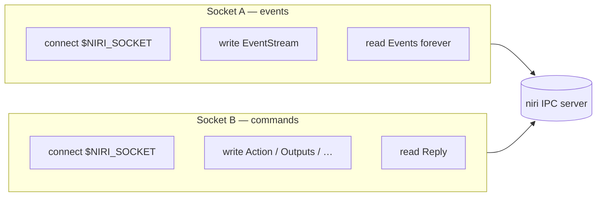
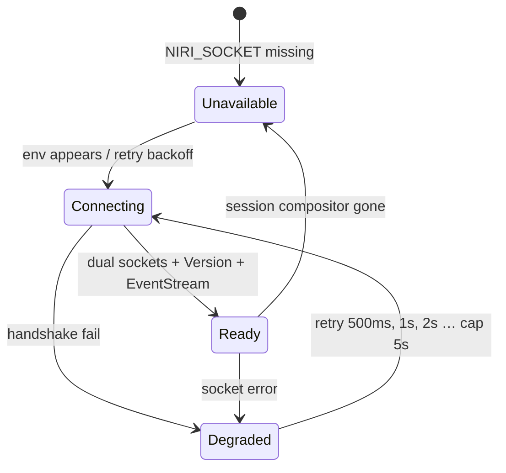

# Compositor: niri-ipc, capabilities, dual socket

Canonical architecture: [`architecture.md`](./architecture.md). Map geometry: [`map.md`](./map.md).

v1 talks to **niri only**, through the official `niri-ipc` crate.

```toml
niri-ipc = "=26.4.0"
```

The crate is **not** Rust-semver stable (new struct fields and enum variants in patch bumps). Pin exact. It is **GPL-3.0-or-later**; linking it makes Reelshell GPL-3.0-or-later.

---

## Dual socket (non-negotiable)

From the crate docs: after `Request::EventStream`, niri **stops reading** subsequent requests on that socket and only writes `Event`s.



```rust
pub struct NiriIpc {
    events: niri_ipc::socket::Socket,  // EventStream, read-only after request
    commands: niri_ipc::socket::Socket,
}

impl NiriIpc {
    pub fn connect() -> Result<Self, Error> {
        let path = std::env::var(niri_ipc::socket::SOCKET_PATH_ENV)?; // NIRI_SOCKET
        let mut events = niri_ipc::socket::Socket::connect()?;
        let commands = niri_ipc::socket::Socket::connect()?;
        // Socket::connect reads NIRI_SOCKET; if we need an explicit path, write JSON ourselves.
        let _ = events.send(niri_ipc::Request::EventStream)?;
        Ok(Self { events, commands })
    }

    pub fn action(&mut self, action: niri_ipc::Action) -> Result<(), Error> {
        let reply = self.commands.send(niri_ipc::Request::Action(action))?;
        reply.map_err(Error::Niri)
    }
}
```

Never send `Action` on the event socket. Never reconnect the event stream on every command (that is the `niri msg` anti-pattern).

Async: `niri_ipc::socket::Socket` is a simple helper. For iced, wrap both sockets in `tokio`/`async-io` nonblocking reads and push `Message::Niri(Event)` into the iced subscription. If the helper cannot go async, talk to the unix socket manually (still serialize `niri_ipc::{Request, Reply, Event}`).

---

## Event stream state

Use `niri_ipc::state::{EventStreamState, EventStreamStatePart}`.

```text
state = EventStreamState::default()
for event in stream:
    state.apply(event)
    derive MapState from state.windows + state.workspaces
```

**Parts are not always consistent across a single event.** Example from upstream: `WorkspaceActiveWindowChanged` may reference a window id before `WindowOpenedOrChanged`. Map rebuild must tolerate missing windows (skip that tile).

`EventStreamState` fields (26.4.0, [docs.rs](https://docs.rs/niri-ipc/26.4.0/niri_ipc/state/struct.EventStreamState.html)): `workspaces`, `windows`, `keyboard_layouts`, `overview`, `config`, **`casts`**. Apply `Cast*` through `EventStreamState::apply` like the other parts. **Not** outputs (re-query `Request::Outputs` on socket B).

The stream **replays full state** on connect (`WorkspacesChanged` with all workspaces, etc.). Do not also send `Request::Workspaces` on the event socket.

---

## Events we consume

| Event | Why |
|---|---|
| `WorkspacesChanged` | Full replace of workspaces; rebind maps to outputs |
| `WorkspaceActivated { id, focused }` | Active workspace on an output changed; `focused` is extra |
| `WorkspaceUrgencyChanged` | Badge |
| `WorkspaceActiveWindowChanged` | HUD / column highlight; **FocusAligned `F`** via `active_window_id` (not global `is_focused`) |
| `WindowsChanged` | Full replace |
| `WindowOpenedOrChanged` | Membership + title/app_id |
| `WindowClosed` | Drop tiles |
| `WindowFocusChanged` | HUD title on the **focused** output only; **do not** drive FocusAligned or `Column.focused` |
| `WindowFocusTimestampChanged` | Launcher MRU (optional) |
| `WindowUrgencyChanged` | Badge even if off-screen |
| **`WindowLayoutsChanged`** | **Column widths and strip order** (not tiled view origin on 26.4.0) |
| `KeyboardLayoutsChanged` / `KeyboardLayoutSwitched` | HUD |
| `OverviewOpenedOrClosed` | Force-unmap filmstrip (snap, no transition) and set `filmstrip.inert`. Bar stays mapped (`top`). |
| `ConfigLoaded` | Re-query outputs |
| `ScreenshotCaptured` | Optional |
| `CastsChanged` / `CastStartedOrChanged` / `CastStopped` | Recording chip; peek privacy |

### Active ≠ focused

```rust
pub fn active_workspace_on<'a>(
    state: &'a niri_ipc::state::EventStreamState,
    output: &str,
) -> Option<&'a niri_ipc::Workspace> {
    state.workspaces.workspaces.values().find(|ws| {
        ws.is_active && ws.output.as_deref() == Some(output)
    })
}
```

Do **not** use `is_focused` to choose which strip to draw on an unfocused monitor.

`Workspace.idx` is the per-monitor index and **changes** as workspaces reorder. Never key Reelshell state on `idx`. Key on `Workspace.id` / `Window.id`.

---

## Commands we send (niri-shaped)

Do not normalize into Hyprland `focus_workspace(2)`.

| Reelshell command | niri `Action` |
|---|---|
| Click/scrub column | `PanColumnOnOutput`: `FocusMonitor { output }` then `FocusColumn { index }` (1-based) on **one** command worker |
| Click window / urgency tile | `FocusWindow { id }` |
| Wheel | `PanColumnDeltaOnOutput`: `FocusMonitor` then `FocusColumnLeft` / `FocusColumnRight` |
| Launcher activate window | `FocusWindow { id }` |
| Launcher spawn | `Spawn { command }` from strictly parsed `.desktop` argv — not `SpawnSh` |
| Layout click | `SwitchLayout { layout }` |
| Never from the map | `FocusWorkspace { reference: Index(n) }` |

`FocusColumn` applies to the **focused** workspace. v1 always prefixes `FocusMonitor` (focus steal OK).

Socket B is serialized; never pipeline two Actions that assume no user input in between.

**Missing in 26.4.0:**

- *Write* view origin (`SetViewPos`) — reserved `CompositorCommand::SetViewOrigin`; scrub is column-quantized.
- *Read* tiled view origin — `tile_pos_in_workspace_view` is **null for tiled windows** ([#2381](https://github.com/niri-wm/niri/issues/2381)). Use `ViewSource::FocusAligned`. [#4147](https://github.com/niri-wm/niri/pull/4147) `scrolling_view_pos` is not merged; `NiriCaps.scrolling_view_pos = false`. Do not vendor a niri fork.

**`Cast` / `CastTarget` (26.4.0):** `Nothing {}` | `Output { name }` | `Window { id }`. Peek/privacy matches these variants.

---

## Outputs (not in the event stream)

`Request::Outputs` lives on **socket B**. There is no `OutputsChanged` event. Refresh:

- after connect (once `EventStream` has produced the first `WorkspacesChanged`)
- on `ConfigLoaded`
- when any workspace `output` field changes
- on a timer only as a last resort (do not poll at 1Hz)

View width comes from the output’s logical size.

---

## Capability enum

```rust
pub enum CompositorCaps {
    Niri(NiriCaps),
    // Hyprland(HyprCaps) — v2+, not compiled in v1
}

pub struct NiriCaps {
    pub window_layouts: bool,
    /// False on 26.4.0. True when `#4147` (or equivalent) is in the pin.
    pub scrolling_view_pos: bool,
    pub overview: bool,
    pub casts: bool,
    pub keyboard_layouts: bool,
    pub output_screencopy: bool,
}

impl NiriCaps {
    pub fn detect(version: &str, saw_layout_event: bool) -> Self {
        Self {
            window_layouts: saw_layout_event || version_at_least(version, 26, 4),
            scrolling_view_pos: false, // bump when pin includes Workspace::scrolling_view_pos
            overview: true,
            casts: true,
            keyboard_layouts: true,
            output_screencopy: true, // output-wide wlr-screencopy; not per-window
        }
    }
}
```

If `window_layouts` is false, the map service is `Degraded` and the UI shows a chip. **Do not** fall back to equal-width pills.

Version check: `Request::Version` on socket B at connect.

---

## Trait boundary

`reelshell-compositor` exposes:

```rust
pub trait Compositor: Send + Sync {
    fn caps(&self) -> CompositorCaps;
    fn apply(&self, cmd: CompositorCommand) -> Result<(), CompositorError>;
}

pub enum CompositorEvent {
    SnapshotApplied, // UI should reread derived MapState
    RawNiri(niri_ipc::Event),
}
```

The niri adapter owns `EventStreamState`. Prefer `reelshell-map::rebuild(&state, output, output_width, caps) -> MapState` (FocusAligned vs compositor origin). FocusAligned’s column `F` is `active_workspace_on(output).active_window_id`’s `pos_in_scrolling_layout` column, **not** `Window.is_focused`.

Commands run on **one worker thread** with a mutex/channel around socket B. `apply` may block that worker, not the iced UI thread.

Event task: on serde deserialize failure (niri newer than crate), log, set Niri `Degraded`, reconnect with backoff — **never abort** the process (niri-taskbar class of bug). Log `Request::Version` vs `=26.4.0`.

Hyprland would implement the same trait with a different `CompositorCommand` mapping — out of v1.

---

## Connect / reconnect



Backoff must not busy-loop (idle CPU budget). The bar stays visible in `Degraded` (last `MapState` optional).

---

## What we never do

- Spawn `niri msg` or `niri msg --json` per event (process tax, races).
- Spawn `qs ipc`.
- Send multiple state queries and assume they are consistent (`Request::Windows` then `Workspaces` on a live compositor — the event stream exists to avoid this).
- Drive niri with workspace-index HUD logic copied from Hyprland modules.
