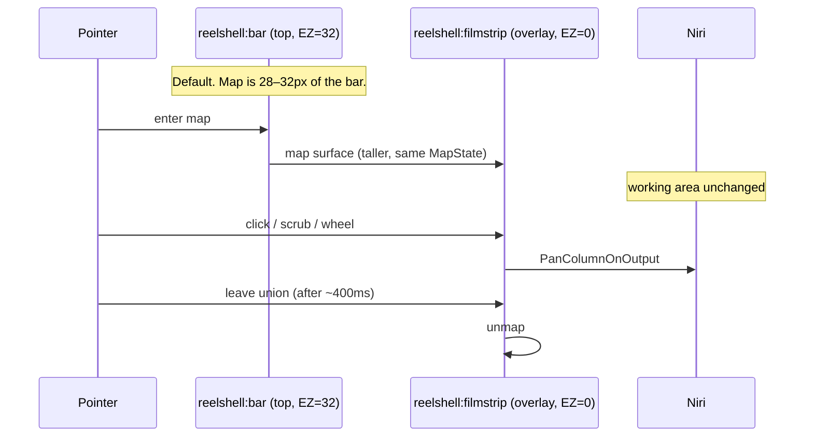
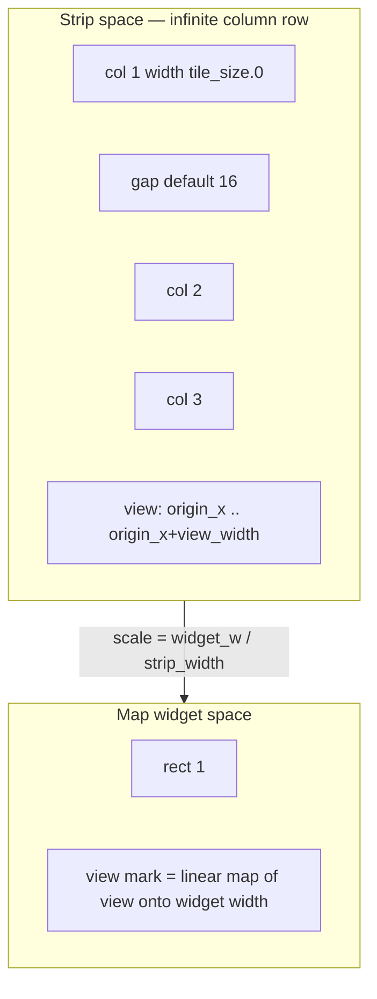

# Map, view, and placement

Canonical product architecture: [`architecture.md`](./architecture.md). If this file and the implementation disagree, this file wins for map behavior.

**UI language:** the strip is the **map**; the highlighted range is the **view**. Do not use “playhead” in the UI.

---

## Placement (critical)

The map **must not** add extra exclusive zone by default.

### Default — map in the panel

The map **replaces workspace pills** in the existing panel.

- Same exclusive zone as a normal niri bar: **~28–32px**.
- Layer: `top` (see [`surfaces.md`](./surfaces.md)).
- Columns: **real relative widths** from niri `WindowLayout.tile_size`.
- View mark: a range, not a Hyprland pill. On 26.4.0 it is **approximate (focus-aligned)** — see reconstruction.

### Expansion — overlay filmstrip (hover only in v1)

On **pointer enter** of the in-bar map, map a taller filmstrip. Keep it mapped while the pointer is in **bar map ∪ filmstrip ∪ 8px slack**; close delay **~400ms** (same as HUD menus). Unmap only after the pointer has been outside that union for the delay — leaving the 32px bar toward the overlay must not unmap it.

| Property | Value |
|---|---|
| Layer | `overlay` |
| `exclusive_zone` | **0** |
| Namespace | `reelshell:filmstrip` |
| Input | pointer; no exclusive keyboard |
| Unmap | pointer outside bar map ∪ filmstrip ∪ 8px slack for ~400ms |

Windows **never move**. Optional `reelshell toggle-filmstrip` latches the overlay; it is not the default.

**Not in v1:** Super-held (niri `spawn` has no key-up; bar keyboard is `None`), two-finger on a 32px surface.



### Two-tier filmstrip (ribbon + detail)

The filmstrip is **not** niri Overview. It must stay visually distinct. Scroll/drag inside it updates **browse position** only (local, never a `CompositorCommand`). Click a column or detail tile to `FocusColumn` / `FocusWindow`, then set browse offset to the resulting view origin.

| Region | Scale | Role |
|---|---|---|
| **Ribbon** | Same proportional fit as the in-bar map (`mapW / strip_width`, clamp ≤ 1) | Whole canvas. Solid **view mark** (`MapState.view`). Dashed **browse mark** (`BrowseState.offset_x` + detail visible width in strip space). |
| **Detail row** | One `dcol` per niri **column** (demo formula: `max(30, (w/maxW)*118+40)`). Vertical splits / tabs are inner panes inside that column, not extra items. | Legible slice. `translateX(-browse_offset_x * detail_scale)`. |

`BrowseState` lives in UI widget state, not `MapState`. Review gate: no wheel/drag handler in the filmstrip may call `Compositor::apply`.

**Overview coexistence:** `OverviewOpenedOrClosed { open: true }` unmaps the filmstrip immediately (no animation) and sets inert. Hover / toggle are no-ops until Overview closes. Filmstrip must not expand or remain expanded while niri Overview is open.

### Forbidden defaults

- Top HUD **plus** a reserved bottom dock (two exclusive zones).
- Permanent bottom exclusive-zone filmstrip (“just 48px”).
- Equal-width workspace pills labeled 1, 2, 3.
- Claiming compositor-true view origin on niri-ipc 26.4.0.
- Filmstrip expanding, or remaining expanded, while niri's real Overview is open.
- Visually replicating niri Overview (zoom/dim/backdrop) in the filmstrip.

### Optional later (not v1)

Super-held, two-finger, hairline ruler, corner chip — all `exclusive_zone = 0`.

### Bar layout (map vs HUD)

| Phase | Map | HUD |
|---|---|---|
| Phase 1 | **100% bar width** | none |
| Phase 4+ | Center flex; min **240px** or **40% of output**; HUD that would push below min goes into an **overflow chip**. Title ellipsizes first. | clock last to hide |

32px is cramped. **Tiny in-bar hit targets are accepted.** Filmstrip is the precision UI.

---

## Coordinate spaces

Three spaces, all **logical pixels** unless noted.



**Do not** use tiled `tile_pos_in_workspace_view` to join niri view space to strip space. That field is **null for tiled windows** on 26.4.0 ([#2381](https://github.com/niri-wm/niri/issues/2381), [#4166](https://github.com/niri-wm/niri/issues/4166)). YaLTeR: per-tile fill is not happening. [#4147](https://github.com/niri-wm/niri/pull/4147) proposes `Workspace::scrolling_view_pos` (not merged).

---

## Reconstruction algorithm

Source of truth: `niri_ipc::Window` + `WindowLayout` on the **active** workspace of **this output**.

`Workspace.is_active` is “visible on this output.” `Workspace.is_focused` is the single globally focused workspace. The map on output `DP-1` follows **active on DP-1**.

### Filter

Keep windows where:

- `workspace_id == active_workspace.id`
- `!is_floating`
- `layout.pos_in_scrolling_layout` is `Some((col, tile))`

Floating windows do not participate in strip width. Fullscreen: use streamed `tile_size` as-is (no extra formula). Tabbed: many windows, one column index.

### Columns

`pos_in_scrolling_layout` is **1-based** and matches `Action::FocusColumn { index }`.

```text
for each window:
  (col_idx, tile_idx) = layout.pos_in_scrolling_layout
  columns[col_idx].tiles.push(TileRef { window_id, app_id, urgent })
  columns[col_idx].width = max(width, layout.tile_size.0)
```

Use **`tile_size`**, not `window_size`.

### Gap

IPC does **not** export `layout.gaps`. Tiled `tile_pos_in_workspace_view` is null, so **inference from adjacent view positions does not work**.

**v1: gap = 16** (niri default). Wrong gap skews the mark by a few pixels; relative column widths stay honest. Do not parse niri KDL in v1.

### Strip x

```text
x = 0
for col in columns.sorted_by_index():
  col.x = x
  x += col.width + gap
strip_width = max(x - gap, 0)
```

Empty workspace: `strip_width = 0`; `view_mark_norm` returns `(0, 1)`.

### View origin — two sources

```rust
pub enum ViewSource {
    FocusAligned, // 26.4.0
    Compositor { scrolling_view_pos: f64 }, // after #4147
}
```

**Phase 1 / 26.4.0 (`FocusAligned`):**

1. `view.width` = output logical width from `Request::Outputs` (top/bottom bar does not shrink width).
2. Let `F` be the column of **`Workspace.active_window_id` on this output’s active workspace**. If that id is missing, floating, or unknown, `F` is the first tiled column. **Do not** use global `Window.is_focused` (empty on unfocused outputs and when a layer-shell has keyboard). `Column.focused` is true **iff** the column is `F` (contains that `active_window_id`). PR5 highlight uses this flag, never `Window.is_focused`.
3. Keep a `last_origin`. Choose the origin in `[F.x + F.width - view.width, F.x]` (clamped to the strip) that **minimizes** `|origin - last_origin|`, so the focused column is fully visible with min movement — niri `center-focused-column "never"` (default).
4. If `F.width >= view.width`, `origin = F.x`.
5. First paint (`last_origin` unset): **left-align** `F` (`origin = F.x`).
6. Set `view.approximate = true`.

This **lies** when the user pans the view without changing focus (touchpad), `center-column`, `center-visible-columns`, or `center-focused-column "always"`. The Phase 1 demo still works: click another column → niri pans → heuristic mark moves.

**After `#4147` (`Compositor`):** `scrolling_view_pos` is niri **scrolling-layout** space (leading gap; often negative). Strip space is column 1 at x = 0 without that gap. Convert as ashell’s minimap does (`view_pos.x = column_x - scrolling_view_pos` inverted into strip origin), then store `View.origin_x` in **strip space**. Never assign the raw f64. `approximate = false`. Still do not fill tiled `tile_pos_in_workspace_view`.

**Median vs mean:** not used. There are no tiled view-position samples to average.

### View mark in the widget

```text
mark_x = view.origin_x / strip_width * widget_width
mark_w = view.width    / strip_width * widget_width
```

Clamp. If `strip_width <= view.width`, the mark spans the whole map. Soften the fill when `approximate`.

**Snap the mark to `MapState.view`.** Do not ease it independently of IPC (HUD chrome may ease).

### Hit testing

Gap belongs to the **left** column (intentional):

```text
strip_x = pointer_x / widget_width * strip_width
column = first col where col.x <= strip_x < col.x + col.width + gap
```

Return 1-based `column.index`.

---

## Interaction (pan, not jump)

| Input | Command | Not |
|---|---|---|
| Click column | `PanColumnOnOutput { output, index }` (`FocusMonitor` then `FocusColumn`) | `FocusWorkspace { Index: n }` |
| Scrub / drag | Coalesce to at most one pan per `wl_surface.frame` as hit column changes | Interpolating niri’s pixels |
| Wheel | `PanColumnDeltaOnOutput` (`FocusMonitor` then left/right) | `FocusWorkspaceUp/Down`; left/right without `FocusMonitor` |
| Click urgency badge | Same as click column (PR9) | |

**IPC limitation (write):** niri 26.4.0 has no `SetViewPos`. Scrub is **column-quantized**.

**v1 default for unfocused output:** always `FocusMonitor` then `FocusColumn` (focus steal OK).

---

## Idle vs hover peek

| Mode | Paint | Capture |
|---|---|---|
| Idle | Icons + proportional rects + view mark | **None** |
| Hover one column, `scrolling_view_pos` **false** | Icon | **None** (26.4.0) |
| Hover one column, cap **true** | Peek = output screencopy **cropped** using compositor origin | One crop, while hovered |
| Leave | Drop buffer | Stop |

Peek is Phase 2 and **gated** on `#4147`. `CastTarget::Window { id }` / `Output { name }` → skip. GameMode → skip. No per-window screencopy promise.

Urgency badges are **v1, not Phase 1**.

---

## Multi-output

One `MapState` per output, keyed by niri output name. Never merge strips.

---

## Acceptance

**Phase 1 kill gate:** ≥4 columns, at least one not the focused column; pointer on the map; **the real desktop slides**; relative widths honest; approximate view mark moves **when focus column changes**; `pidstat` idle ≤1% for 10s.

**Fail:** Hyprland pills; workspace-index jumps; extra exclusive zone; vsync loop; **marketing the mark as compositor-accurate** on 26.4.0.

Code review gates:

- `exclusive_zone` for filmstrip is the literal `0`.
- Map path does not call `Action::FocusWorkspace`.
- No reconstruction of tiled view origin from `tile_pos_in_workspace_view`.
- No equal-width fallback when layouts are missing — `Degraded` chip instead.
- No wheel/drag handler inside the filmstrip may call `Compositor::apply` or construct a `CompositorCommand`. Only click handlers may.
- With the filmstrip expanded, opening niri Overview retracts it with zero animation; hover while Overview is open must not re-expand it.
