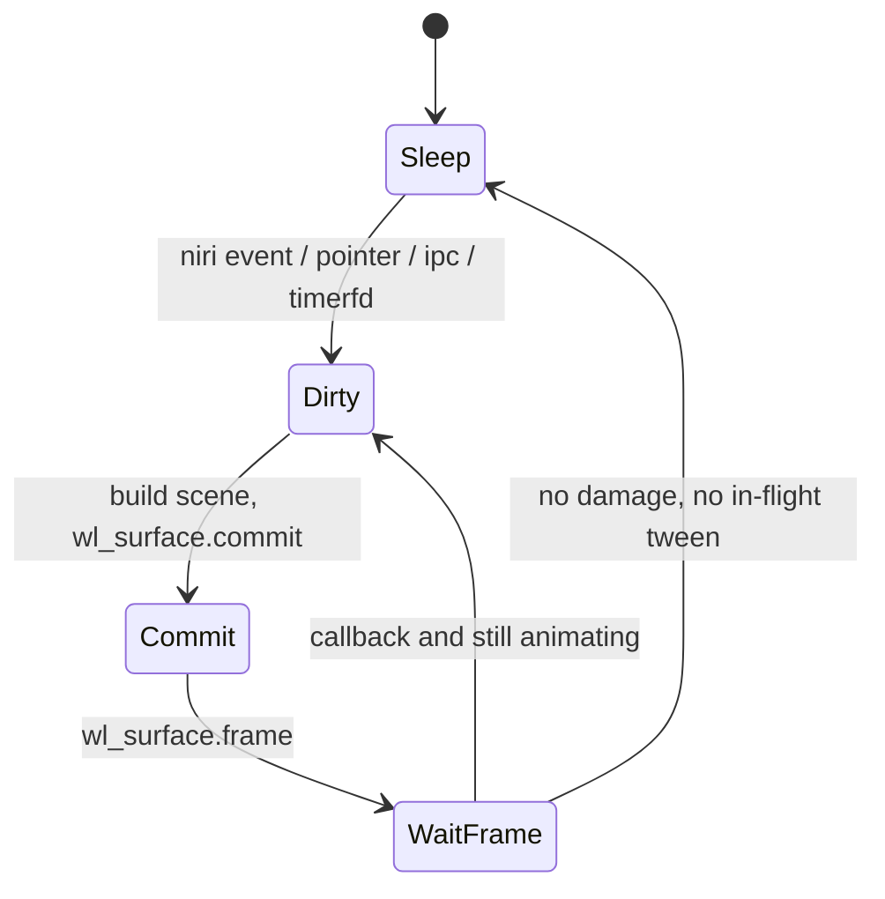
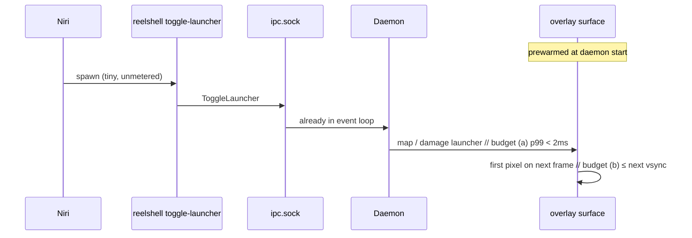

# Performance: budgets, clocks, damage

Canonical architecture: [`architecture.md`](./architecture.md). These numbers are **release gates**.

---

## Budgets

| Metric | Target | Fail if |
|---|---|---|
| Idle CPU, bar only, no visualizer | damage-driven sleep | `pidstat -u -p $pid 1 10` → reelshell **>1%** for 10s on a static desktop |
| RSS, one output | well under 100MB | Steady `ps -o rss=` **≥ 100000** KB after icon warm |
| Launcher (a) IPC → damage | p99 **< 2ms** | Span `ipc_read → request_redraw` p99 ≥ 2ms |
| Launcher (b) first presented pixel | **≤ next vsync** after (a) | Overlay not committed on the following frame callback. **Do not** pack niri `spawn` + present into 16ms. |
| Menu hover | every vblank while open | Popup unmaps when crossing the 1px gap |
| Boot to visible bar | first layer commit | Blank until niri / NM / desktop files |
| GameMode / reduced-motion | duration 0 | Tweens still scheduled |

**Phase 1 (PR2 + PR6)** must meet idle CPU and first-frame bar. Launcher (a)(b) are PR11. `pidstat` / RSS are recorded on **PR6**, not “README later.”

**Iced cannot sleep → Phase 1 kill** (GTK4 for the **bar**). Popup grab may still hatch to GTK4 menus later.

---

## Why Quickshell is out

Noctalia v5 left Quickshell over memory and idle. iNiR is commonly 200–400MB. `qs ipc` on Super cannot hit the launcher budget. Reelshell’s stack is Rust + iced + iced_layershell so a static 32px bar can **sleep**. GPUI may win peak GPU motion; it does not automatically win idle (Zed keeps painting; `gpui-shell` idle RSS has been ~230MB). PR2 `pidstat` is the stack test, not Zed-vs-Electron blog numbers.

---

## LazyClock — one timestamp per tick

niri itself uses presentation time / a lazy clock: widgets must not call `Instant::now()` independently, or animations desync.

```rust
use std::time::Instant;

/// Written once at the start of the iced update/subscription drain.
#[derive(Clone, Copy)]
pub struct LazyClock {
    tick: Instant,
    presentation: Option<Instant>,
}

impl LazyClock {
    pub fn begin_tick() -> Self {
        Self { tick: Instant::now(), presentation: None }
    }

    pub fn now(self) -> Instant { self.tick }

    /// If the compositor gave a frame callback time, animations use this.
    pub fn anim_t(self) -> Instant {
        self.presentation.unwrap_or(self.tick)
    }
}
```

Pass `LazyClock` through `update`/`view`. Animation progress:

```text
t = clamp((clock.anim_t() - start) / duration, 0, 1)
ease = 1 - (1 - t)^3   // ease-out cubic
pixel = from.lerp(to, ease)
```

**Actions apply immediately** (niri already panned). **The view mark always snaps** to `MapState.view` (no second physics). Easing is for HUD chrome only (launcher fade, menu).

Duration: **120–180ms** default (config `motion.duration-ms`). `Motion::Snap` sets duration 0 and **does not spawn** animation tasks.

---

## Damage-driven frames (no vsync loop)



Rules:

1. A **static** bar must not subscribe to a 60Hz / 120Hz redraw.
2. After commit, wait for `wl_surface.frame` before another animated commit (pace with the display, avoid queueing 10 frames).
3. Coalesce niri events in one tick: many `WindowLayoutsChanged` during a niri animation → one `MapState` rebuild → one commit per frame callback.
4. Clock: `timerfd` (or iced `every`) at **next minute** while idle; 1Hz only while the clock chip is hovered.
5. Network/audio/battery: evented D-Bus/PipeWire. No 1s poll.

If iced’s default wgpu presenter always redraws, that is a **Phase 1 blocker** — measure in **PR2**. GTK4 hatch for the bar, not PR19. `LazyClock` lands in **PR5**. PR19 is GameMode / `Motion::Snap` only.

---

## Map rebuild cost

Target: p99 `map_rebuild_us` < 1000µs for 20 columns.

- Rebuild only when windows/layouts/workspace-active/output size change — not on clock ticks.
- Hash a fingerprint `(workspace_id, layouts_generation, active_window_id, focused_column, view_source)` to skip paint if geometry **and FocusAligned inputs** are identical. Rebuild FocusAligned on **`WorkspaceActiveWindowChanged`** (and layouts / workspace-active / output size), **not** `WindowFocusChanged` (HUD-only). Omitting `active_window_id` would skip mark updates when this output’s active column changes and fail the Phase 1 pass.
- Hit-test is O(columns); linear is fine.

---

## Idle memory

| Allocation | Policy |
|---|---|
| wgpu device / bar surface | One per process (or per output, unavoidable) |
| Icon atlas | Rasterize on first use; cap size; no SVG scripts |
| Hover peek buffer | One window; drop on leave |
| Desktop files | Deferred after first frame; strings only until search |
| Notification history | Cap (e.g. 50); not a file indexer |

No live video of the strip. No always-on Cava. No in-process blur kernel.

---

## Launcher budget



The spawned process is a unix-socket client, **not** a second iced runtime. “Warm” means the daemon has been up (shaders loaded). niri `spawn` duration is **outside** the millisecond budget.

Measure: span `ipc_read → request_redraw`; commit on the next `wl_surface.frame`.

---

## Reduced motion / GameMode

```rust
pub fn motion_from_config(cfg: &Config, env: &Env) -> Motion {
    if cfg.motion.reduced || env.prefers_reduced_motion() || env.gamemode_active() {
        Motion::Snap
    } else {
        Motion::Animate { duration: Duration::from_millis(cfg.motion.duration_ms) }
    }
}
```

`Motion::Snap`:

- Skip iced animation subscriptions.
- Unmap filmstrip immediately (no fade).
- Peek disabled (screencopy is a GPU wake).
- OSD appears and disappears without tween.

Detect GameMode via the GameMode D-Bus API if present; else config.

---

## Blur

Client Gaussian is out of v1 (cost + shape bugs). Use niri:

```kdl
layer-rule {
    match namespace="^reelshell:"
    background-effect {
        xray true
        blur true
    }
}
```

If the user has no rule, the bar is a cheap opaque/translucent fill. Do not enable blur in a way that forces niri to blur a 4K region at 120Hz for a static bar — keep the bar mostly opaque if profiling shows compositor cost.

---

## Observability for budgets

`REELSHELL_LOG=reelshell::frame=debug`:

- `idle_ms_since_commit`
- `map_rebuild_us`
- `launcher_open_to_first_commit_ms`
- whether this commit was `damage` vs `animation`

CI: no automated GPU test in v1; README dogfood checklist (idle `pidstat`, `ps` RSS, Super timing).

---

## Boot sequence (first frame)

```text
1. Bind ipc.sock (single instance; PR2, Ping-only until PR10)
2. Create bar layer surface, commit solid chrome      ← visible
3. Connect niri dual sockets (async)
4. First WorkspacesChanged + layouts → paint map
5. Deferred: desktop files, icon theme, NM, UPower, PipeWire, SNI, notifications
```

If step 3 fails, the bar still exists (`Niri: Unavailable` chip). Users must never wait on NetworkManager for a shell.
