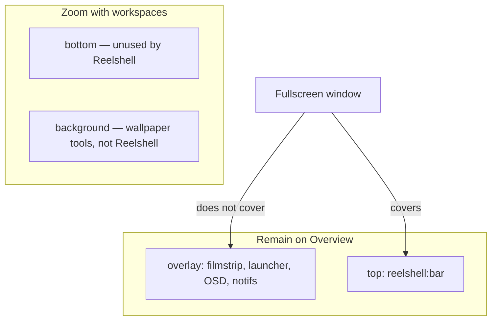

# Wayland surface roles

Canonical architecture: [`architecture.md`](./architecture.md). Placement rules: [`map.md`](./map.md).

Reelshell is a multi-surface iced_layershell application. Do not invent a toolkit. Surface **roles** are the API: every `zwlr_layer_surface_v1` has a namespace, layer, exclusive zone, and keyboard policy listed here.

---

## Role table

| Role | Layer | exclusive_zone | Namespace | Keyboard | Survives Overview | Above fullscreen |
|---|---|---|---|---|---|---|
| Bar / HUD + in-panel map | `top` | bar height (28–32) | `reelshell:bar` | None | **Yes** (`top`) | No |
| Filmstrip expansion | `overlay` | **0** | `reelshell:filmstrip` | None | Yes | Yes |
| Launcher | `overlay` | 0 | `reelshell:launcher` | Exclusive while mapped | Yes | **Yes** (must) |
| OSD | `overlay` | 0 | `reelshell:osd` | **None** | Yes | Yes |
| Notification pop | `overlay` | 0 | `reelshell:notification` | None | Yes | Yes |
| HUD menus | `xdg_popup` | n/a | child of bar | grab | with parent | with parent |

Namespaces are **stable** so niri `layer-rule { match namespace="^reelshell:" }` works. Do not include PIDs or random suffixes.

```rust
#[derive(Clone, Copy, Debug, PartialEq, Eq)]
pub enum SurfaceRole {
    Bar,
    Filmstrip,
    Launcher,
    Osd,
    Notification,
}

impl SurfaceRole {
    pub fn namespace(self) -> &'static str {
        match self {
            Self::Bar => "reelshell:bar",
            Self::Filmstrip => "reelshell:filmstrip",
            Self::Launcher => "reelshell:launcher",
            Self::Osd => "reelshell:osd",
            Self::Notification => "reelshell:notification",
        }
    }
}
```

Multi-output: same namespace **per role** is what niri and other compositors expect (one surface per output, same namespace). Identify outputs via layer-shell `output` bind, not via namespace.

---

## niri layer-shell rules (encode the wiki)

From [Layer-Shell Components](https://niri-wm.github.io/niri/Layer%E2%80%90Shell-Components.html) and [Layer Rules](https://github.com/niri-wm/niri/blob/main/docs/wiki/Configuration:-Layer-Rules.md):

1. **Fullscreen covers `top`.** A launcher on `top` is invisible over a fullscreen window. Launchers, OSD, filmstrip, notifications: **`overlay`**.
2. **Overview:** `background` and `bottom` zoom with workspaces; **`top` and `overlay` stay on the Overview.** The bar must be `top` (or `overlay`) to remain usable. We choose `top` so a fullscreen-covering overlay launcher does not compete with the bar’s exclusive zone.
3. **`place-within-backdrop`:** only for **background** layers that ignore exclusive zones (wallpapers). Reelshell **does not** set this. Backdrop is wallpaper’s job (out of v1).
4. **`background-effect` / `ext-background-effect`:** compositor xray blur via user `layer-rule`. Reelshell may draw translucent surfaces; it must **not** run a client Gaussian. Opaque fallback if the user has no rule.
5. **Exclusive zone:** niri shrinks the scrolling working area by the zone. Filmstrip `exclusive_zone = 0` is load-bearing. OSD/notifications/launcher also 0 so they never shove columns.



Suggested user config (optional, documented, not required for correctness):

```kdl
layer-rule {
    match namespace="^reelshell:"
    geometry-corner-radius 8
    background-effect {
        xray true
        blur true
    }
}
```

---

## Bar (`reelshell:bar`)

- Anchor: top (default) or bottom from config — **one** edge.
- Size: height fixed; width = output.
- Exclusive zone = height. Margin 0.
- Keyboard: `None`. Super is a niri bind → `reelshell` IPC, not bar key focus.
- First frame: commit an opaque/translucent rectangle **before** niri IPC is `Ready`.
- Input region: full bar (map + HUD). Do not punch holes that drop hover-to-popup paths.

### iced_layershell sketch (intent only)

Pin **`iced_layershell = "=0.19.1"`**. **Re-copy fields from that crate in PR2** — 0.18 used `exclusive_zone: Option<i32>` and `output_option: OutputOption`, not the names below.

```rust
// PSEUDOCODE — replace with 0.19.1 NewLayerShellSettings field-for-field.
fn bar_settings(output: OutputOption, height: u32) -> NewLayerShellSettings {
    NewLayerShellSettings {
        size: Some((0, height)),
        layer: Layer::Top,
        anchor: Anchor::Top | Anchor::Left | Anchor::Right,
        exclusive_zone: Some(height as i32), // confirm Option vs i32 in 0.19.1
        keyboard_interactivity: KeyboardInteractivity::None,
        namespace: Some("reelshell:bar".into()),
        output_option: output,             // confirm name in 0.19.1
        ..Default::default()
    }
}
```

Confirm `NewMenu` / `xdg_popup` grab in **PR2**, not PR13. If grab is broken: GTK4 **menus**. If the bar cannot idle-sleep: GTK4 **bar** is a Phase 1 kill (see architecture).

---

## Filmstrip (`reelshell:filmstrip`)

- Mapped only while expanded.
- `Layer::Overlay`, `exclusive_zone: 0`, height ~80–120px visual, still **not** exclusive.
- Anchor same edge as the bar so it visually extends the map.
- **v1 trigger: pointer hover** (optional `ToggleFilmstrip` latch). Not Super-held, not two-finger.
- Keep mapped while pointer is in **bar map ∪ filmstrip ∪ 8px slack**; close delay **~400ms** (same as menus). Peek, when enabled, is in that union. Input region is filmstrip pixels only, not the full output.
- PR7 test: pointer travels bar → filmstrip without unmap.

**Invariant:** mapping/unmapping the filmstrip does not change niri’s working area. Do **not** test with tiled `tile_pos_in_workspace_view` (null on 26.4.0). Compare output logical size / a screenshot of working-area height, or a floating window’s `tile_pos_in_workspace_view.y` if one exists.

---

## Launcher (`reelshell:launcher`)

- `overlay` so it wins over fullscreen.
- Centered panel or near-fullscreen dimming scrim. Scrim can be the same surface with a transparent input region around the list, or a full-output surface.
- Keyboard: Exclusive **while mapped**; restore None on unmap.
- Prewarm: create the surface at startup. Hidden = unmapped or opacity 0 + empty input region. Measure both; pick the one that hits **budget (b): first presented pixel ≤ next vsync after damage** without keeping the GPU awake at idle (unmap is preferred if remap still meets that). Do **not** pack niri `spawn` + present into 16ms.

---

## OSD (`reelshell:osd`)

- Volume / brightness only in v1.
- `overlay`, `exclusive_zone = 0`.
- **No exclusive keyboard.** OSD must not steal typing from the focused window.
- Auto-dismiss ~1–1.5s. Damage-driven: one commit to show, one to hide.

---

## Notifications (`reelshell:notification`)

- Reelshell owns `org.freedesktop.Notifications` (see architecture). Surfaces are overlay toasts, `exclusive_zone = 0`, pointer input on buttons only if we set an input region.
- Do not use `top` (fullscreen would hide toasts).

---

## Menus (`xdg_popup` + `xdg_positioner` + grab)

Hover menus for network / audio / battery / tray:

| Timing | Value |
|---|---|
| Open delay | 200–300ms |
| Close delay | ~400ms |
| Pointer path panel → popup | **does not cancel** |

Implementation: iced_layershell `NewMenu` / `NewPopUp` with `xdg_positioner` anchor on the HUD chip. Grab so clicks outside dismiss.

**Flicker:** do not destroy and recreate the popup on every `PointerEvent::Enter` between bar and popup. Use a single popup id and a close timer that resets while the pointer is in the union of bar chip + popup + 8px slack.

If iced_layershell grab is insufficient (Open Question), the GTK4 escape hatch applies to **menus only**.

---

## Input regions

Use `SetInputRegion` so:

- Unmapped-looking launcher scrim does not eat clicks (if we keep the surface mapped at opacity 0).
- OSD has no input (pass-through) unless we add a mute click later.
- Filmstrip covers only its pixels, not the whole output.

---

## Blur and shadows

- No in-process blur in v1.
- Shadows: prefer niri `layer-rule { shadow { on } }` over drawing fake CSS shadows that inflate damage.

---

## Lifecycle vs outputs

On output connect: create `Bar` (and idle-unmapped Filmstrip/Launcher if prewarm-per-output is required). On disconnect: destroy those surfaces. `Request::Outputs` is not evented — resync when workspaces change `output` or on `ConfigLoaded`.
